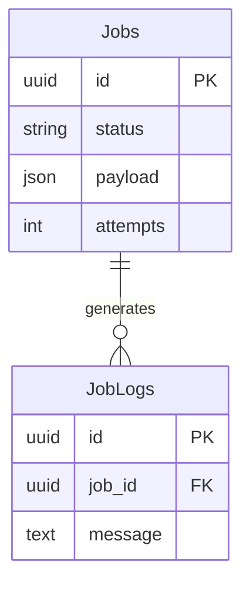

# Feature: Job Processing

## Navigation
- [Overview](./overview.md) | [API](../../api/background-jobs/api-background-jobs.md) | [Testing](../../testing/background-jobs/test-background-jobs.md)

## 1. Overview
- **Role:** Central engine for async and scheduled operations.
- **Value:** Guarantees throughput and enables horizontal scaling.

## 2. User Stories
- **US-JOB-01:** Monthly reports run automatically (1st @ 00:00).
- **US-JOB-02:** Developers inspect failed jobs in DLQ via dashboard.
- **US-JOB-03:** Users request large data exports without UI blocking.

## 3. Logic & Rules
- **Flow:** Producer → Queue → Worker → Handler → Log.
- **Idempotency:** Jobs must be safe to retry.
- **Retry:** Exponential backoff + DLQ.
- **Locking:** Prevent duplicate scheduled runs.

## 4. Data Model

## 5. Audit
- **Log Retention:** Keep failed job history.
- **Privacy:** Mask PII in payloads/logs.

## 6. Tasks
- **Backend:** Setup broker, JobDispatcher, BaseWorker, scheduled/long-running jobs, monitoring.
- **Frontend:** Dashboard integration, export notifications.
