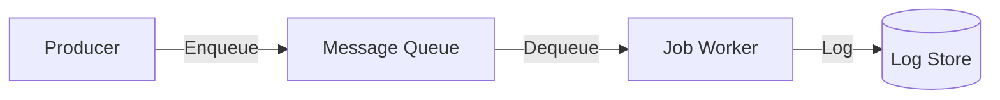

# Module: Background Jobs

## Navigation
- [Module List](../../README.md)

## 1. Intro
- **Role:** Async queue and schedule management.
- **Value:** Offloads heavy work to ensure API responsiveness.

## 2. Features
- **Job Processing:** Queue workers, retries, DLQ. [Details](./job-processing.md)

## 3. Architecture

## 4. Deps
- **Queue:** Redis/SQS.
- **Alerts:** Failure notifications.
- **Config:** Retry/Timeout settings.
