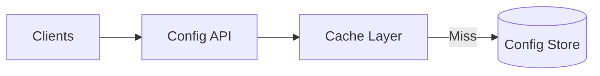

# Module: Configuration

## Navigation
- [Module List](../../README.md)

## 1. Intro
- **Role:** Centralized key-value store for system settings.
- **Value:** Enables runtime changes without redeployment.

## 2. Features
- **System Config:** Dynamic management and feature flags. [Details](./system-config.md)

## 3. Architecture

## 4. Deps
- **Store:** Relational DB.
- **Cache:** Redis (Performance critical).
- **IAM:** Admin write access.
