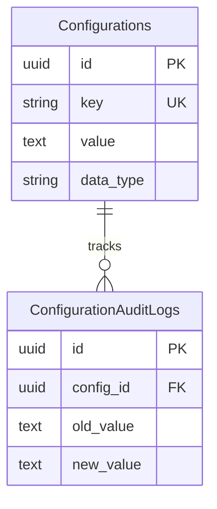

# Feature: System Configuration

## Navigation
- [Overview](./overview.md) | [API](../../api/configuration/api-configuration.md) | [Testing](../../testing/configuration/test-configuration.md)

## 1. Overview
- **Role:** Runtime control plane for app behavior.
- **Value:** Agility via feature toggles and live updates.

## 2. User Stories
- **US-CFG-01:** Admin toggles maintenance mode (503 for non-whitelisted).
- **US-CFG-02:** PO enables feature flags for canary/AB testing.
- **US-CFG-03:** Frontend fetches dynamic contact/system info.
- **US-CFG-04:** System caches values (<50ms latency) with auto-invalidation.

## 3. Logic & Rules
- **Flow:** Client → API → Cache (Fallback to DB).
- **Immutability:** Keys cannot be renamed after creation.
- **Types:** String, Boolean, Number, JSON.
- **Cache:** Delete key on update; next read repopulates.

## 4. Data Model

## 5. Audit
- **Trail:** Record `old_value`, `new_value`, and `actor_id` on update.

## 6. Tasks
- **Backend:** Schema migration, typed entity, ConfigService (cache), CRUD controllers.
- **Frontend:** API wrapper, boot-time fetch, admin manager, ConfigEditor form.
