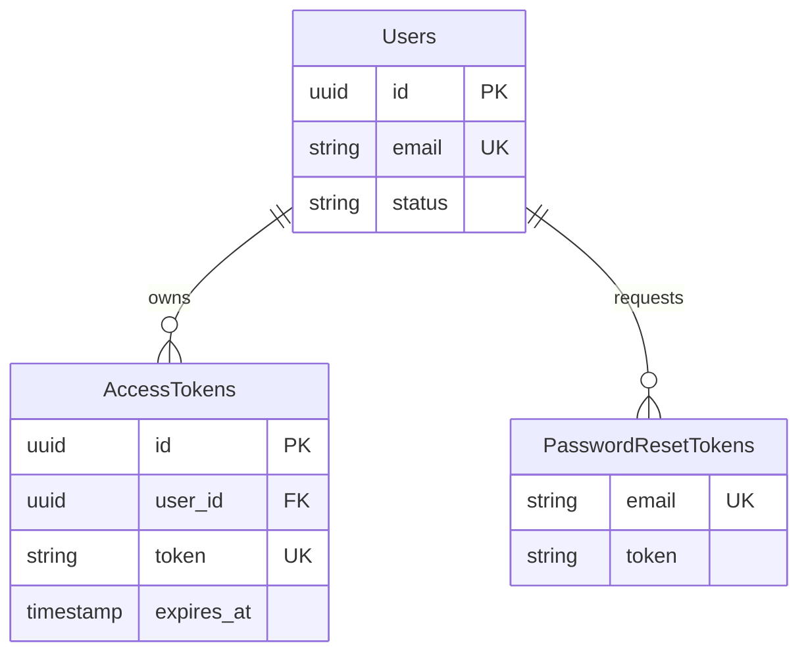

# Feature: Authentication

## Navigation
- [Overview](./overview.md) | [API](../../api/iam-security/api-authentication.md) | [Testing](../../testing/iam-security/test-authentication.md)

## 1. Overview
- **Role:** Primary defense gateway validating all subjects.
- **Value:** Secure assets via modern standards and seamless UX.

## 2. User Stories
- **US-AUTH-01:** User logins create sessions; invalid/inactive are rejected.
- **US-AUTH-02:** User logouts invalidate sessions and revoke tokens.
- **US-AUTH-03:** User activates account via time-limited email link.
- **US-AUTH-04:** User changes password with security policy enforcement.
- **US-AUTH-05:** User resets forgotten password via email recovery.

## 3. Logic & Rules
- **Email:** Must be unique per user.
- **Policy:** Min 8 chars, mixed case/numbers.
- **Expiry:** Access (1h), Refresh (30d).
- **Audit:** Log every attempt with IP address.

## 4. Data Model

## 5. Audit
- **Storage:** Hash passwords with bcrypt/argon2.
- **Login Trail:** Record actor, IP, timestamp, and outcome.

## 6. Tasks
- **Backend:** Schema, seeding, AuthService, PasswordService, controllers.
- **Frontend:** State store, API wrapper, Auth pages, Route Guards.
