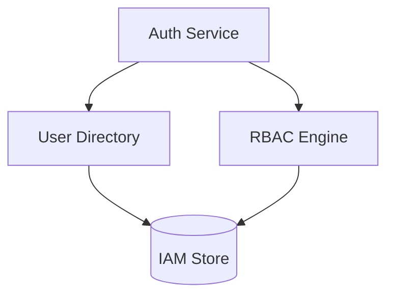

# Module: IAM & Security

## Navigation
- [Module List](../../README.md)

## 1. Intro
- **Role:** Identity, authentication, and authorization foundation.
- **Value:** Protects data and ensures only authorized access.

## 2. Features
- **Authentication:** Login, register, tokens. [Details](./authentication.md)
- **User Management:** Lifecycle, status, auditing. [Details](./user-management.md)
- **RBAC:** Granular roles and permissions. [Details](./role-permission-management.md)

## 3. Architecture

## 4. Deps
- **Store:** Relational DB.
- **Email:** Password reset and activation flows.
- **Config:** Auth secrets and TTL values.
