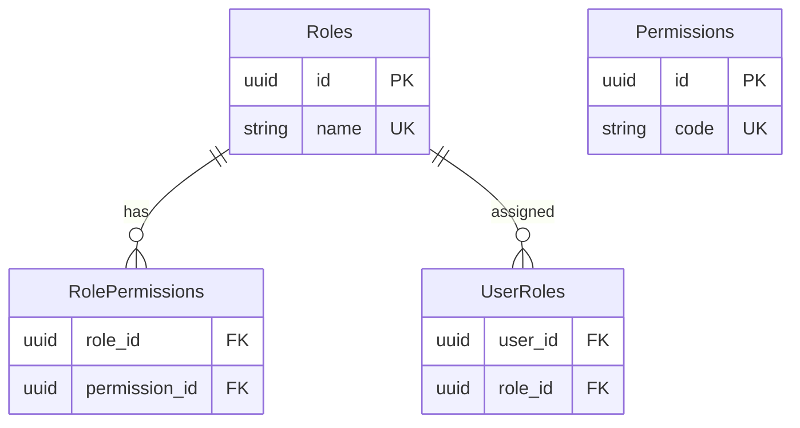

# Feature: Role & Permission Management

## Navigation
- [Overview](./overview.md) | [API](../../api/iam-security/api-role-permission-management.md) | [Testing](../../testing/iam-security/test-role-permission-management.md)

## 1. Overview
- **Role:** Policy engine determining "who can do what".
- **Value:** Minimizes privilege escalation risk and simplifies access admin.

## 2. User Stories
- **US-RBAC-01:** Admin manages roles (create/update/delete).
- **US-RBAC-02:** Admin assigns multiple roles to users with audit trails.
- **US-RBAC-03:** Admin configures granular permissions (CRUD) per role.
- **US-RBAC-04:** System enforces 403 blocks and hides restricted UI items.

## 3. Logic & Rules
- **Super Admin:** Immutable role that cannot be deleted.
- **Codes:** Permission codes are fixed in code (e.g., `users:create`).
- **Audit:** Log all assignment changes with actor and timestamp.

## 4. Data Model

## 5. Audit
- **Critical actions:** Log actor, timestamp, and state diff for all RBAC changes.

## 6. Tasks
- **Backend:** Schema, seeding, PermissionGuard middleware, RBACService, controllers.
- **Frontend:** State management, RoleManager UI, UI Permission Guards.
