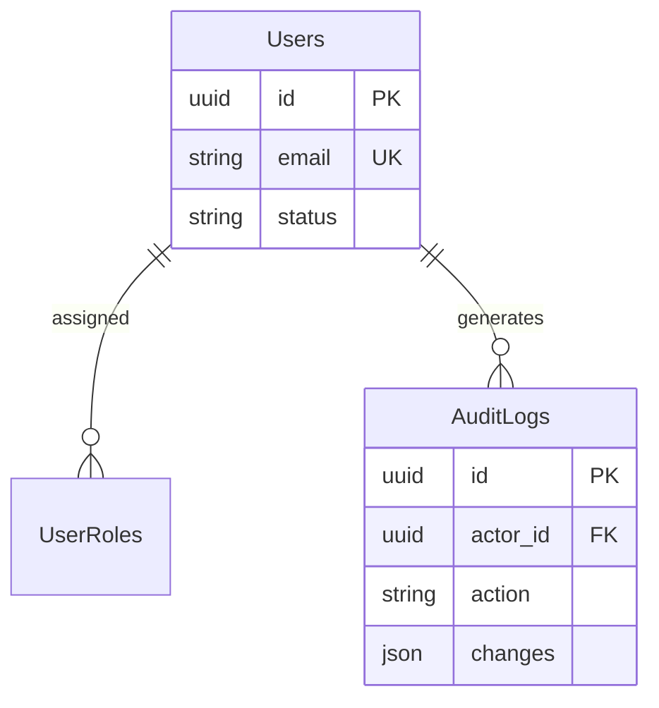

# Feature: User Management

## Navigation
- [Overview](./overview.md) | [API](../../api/iam-security/api-user-management.md) | [Testing](../../testing/iam-security/test-user-management.md)

## 1. Overview
- **Role:** Authoritative source for identity and status.
- **Value:** Centralized, auditable control of system access.

## 2. User Stories
- **US-USR-01:** Admin creates users with unique emails and default status.
- **US-USR-02:** Users update profiles (name, avatar) with re-verification.
- **US-USR-03:** Admin suspends users to block login while keeping history.
- **US-USR-04:** Admin monitors secure, immutable activity logs.

## 3. Logic & Rules
- **Access:** Admin only for lists/status; users only for self-edits.
- **Passwords:** Stored as hashes; never returned in API.

## 4. Data Model

## 5. Audit
- **Status Trail:** Record admin ID, action, and value diff on status changes.

## 6. Tasks
- **Backend:** Soft-delete schema, seeding, UserService, CRUD controllers, tests.
- **Frontend:** State management, UserListTable, UserForm, Integration.
