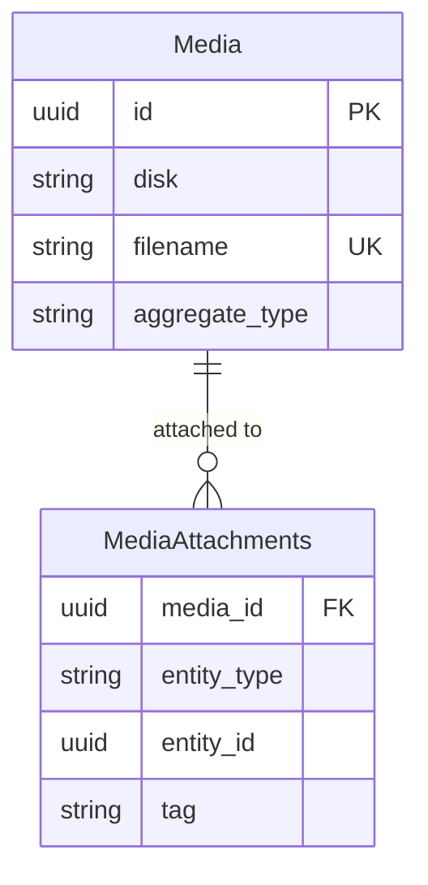

# Feature: File Management

## Navigation
- [Overview](./overview.md) | [API](../../api/media-management/api-media-management.md) | [Testing](../../testing/media-management/test-media-management.md)

## 1. Overview
- **Role:** Unified storage interface for digital assets.
- **Value:** Cost optimization and high availability.

## 2. User Stories
- **US-MED-01:** User uploads 1:1 avatar (JPG/PNG/WEBP, <2MB).
- **US-MED-02:** Admin manages product gallery (reorder/delete/featured).
- **US-MED-03:** System generates variants (original/800px/200px) with compression.
- **US-MED-04:** User attaches docs (PDF/DOCX) with signed URL preview.

## 3. Logic & Rules
- **Flow:** Upload → Validate → Store → Save Metadata → Link to Entity.
- **Limits:** 5MB for images, 20MB for documents.
- **Cleanup:** Unlinked temporary files deleted after 24h.

## 4. Data Model

## 5. Audit
- **Access:** Private files require signed URLs.
- **Sanitization:** Filenames cleaned to prevent traversal.

## 6. Tasks
- **Backend:** Storage layer, schema, entity (URL accessor), MediaService, controllers.
- **Frontend:** FileUploader component, Gallery selector, API client.
