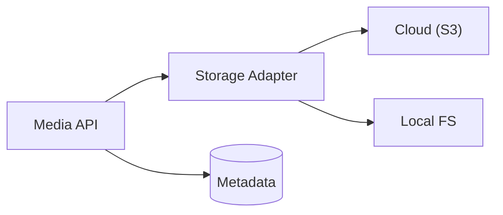

# Module: Media Management

## Navigation
- [Module List](../../README.md)

## 1. Intro
- **Role:** Centralized asset storage and attachment logic.
- **Value:** Decouples storage concerns from business domains.

## 2. Features
- **File Management:** Upload, store, transform, attach. [Details](./file-management.md)

## 3. Architecture

## 4. Deps
- **Config:** Provider credentials, MIME limits, size limits.
- **Libs:** Storage abstraction, image processing.
