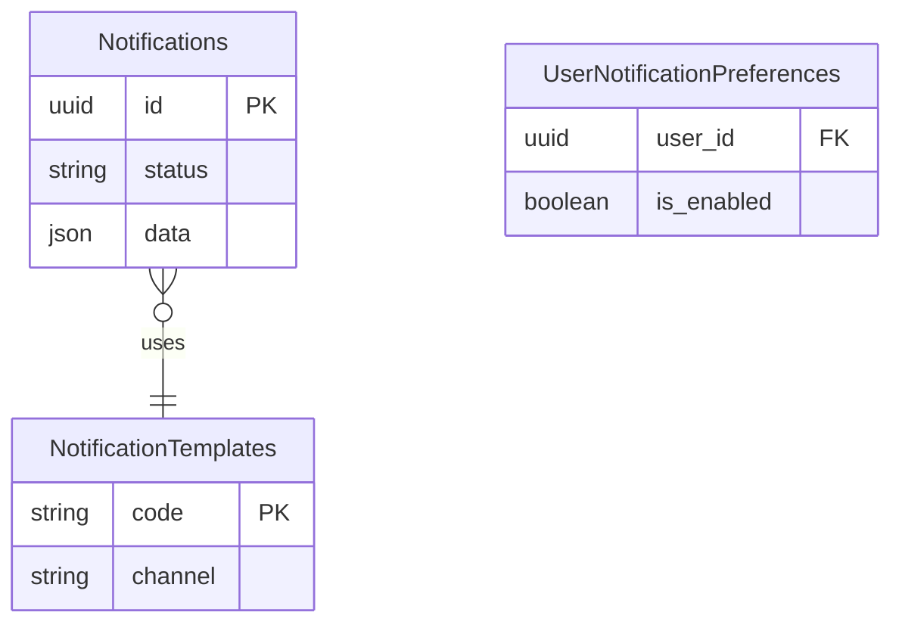

# Feature: Notification System

## Navigation
- [Overview](./overview.md) | [API](../../api/notification/api-notifications.md) | [Testing](../../testing/notification/test-notification.md)

## 1. Overview
- **Role:** Communication hub bridging system and users.
- **Value:** Increases retention through timely, relevant messaging.

## 2. User Stories
- **US-NOT-01:** System sends rate-limited OTP codes via Email/SMS.
- **US-NOT-02:** Users get status updates on orders/events.
- **US-NOT-03:** Users manage an in-app inbox (read/unread, grouped).
- **US-NOT-04:** System retries failures using exponential backoff (max 3).

## 3. Logic & Rules
- **Flow:** API → Queue → Worker → Template Rendering → Channel Provider.
- **Preferences:** Respect user opt-out settings for all channels.
- **Retention:** Keep notification logs for 1 year.

## 4. Data Model

## 5. Audit
- **Anti-spam:** Enforce unsubscribe logic.
- **Security:** Mask OTP values in logs.

## 6. Tasks
- **Backend:** Schema, template seeding, NotificationService, RetryJobs, controllers.
- **Frontend:** State store, NotificationBell, NotificationList UI, real-time integration.
