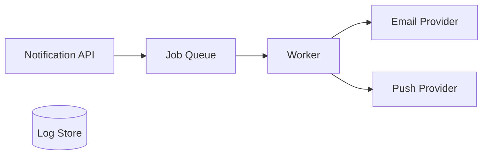

# Module: Notification

## Navigation
- [Module List](../../README.md)

## 1. Intro
- **Role:** Omnichannel delivery (Email, Push, SMS, In-app).
- **Value:** Boosts engagement through timely transactional/promotional comms.

## 2. Features
- **Notification System:** Templates, queuing, and tracking. [Details](./notification-system.md)

## 3. Architecture

## 4. Deps
- **IAM:** User ID and preference validation.
- **Config:** Provider credentials (SMTP, FCM).
- **Queue:** Async infrastructure.
