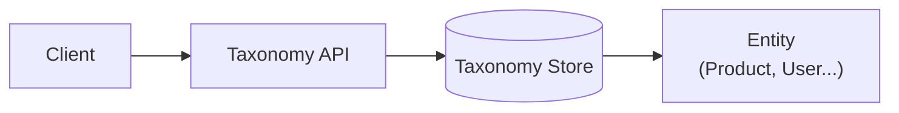

# Module: Taxonomy

## Navigation
- [Module List](../../README.md)

## 1. Intro
- **Role:** Entity-agnostic classification (categories, tags, labels).
- **Value:** Ensures consistency; eliminates redundant category logic across domains.

## 2. Features
- **Taxonomy Management:** Hierarchy, tags, and polymorphic attachments. [Details](./taxonomy-management.md)

## 3. Architecture


## 4. Deps
- **Store:** Relational DB (FK integrity required).

```