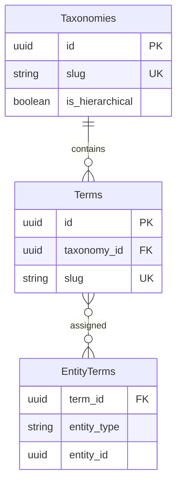

# Feature: Taxonomy Management

## Navigation
- [Overview](./overview.md) | [API](../../api/taxonomy/api-taxonomy.md) | [Testing](../../testing/taxonomy/test-taxonomy.md)

## 1. Overview
- **Role:** Source of truth for nomenclature and data grouping.
- **Value:** Eliminates redundant category structures and improves reporting.

## 2. User Stories
- **US-TAX-01:** Admin defines new taxonomy types (Skill, Category, etc.).
- **US-TAX-02:** Admin manages terms within a taxonomy (CRUD, hierarchy).
- **US-TAX-03:** System attaches terms to entities via polymorphic relations.
- **US-TAX-04:** Users filter data by categories or tags (AND/OR logic).

## 3. Logic & Rules
- **Flow:** Caller → Taxonomy Service → Validate → Link to Entity.
- **Slugs:** Slugs must be unique and immutable after creation.
- **Deduplication:** Prevent attaching the same term to one entity twice.

## 4. Data Model

## 5. Audit
- **Logging:** Log structural changes (create/update/delete) with actor ID.

## 6. Tasks
- **Backend:** Schema migration, pivot table, TaxonomyService, CRUD controllers.
- **Frontend:** State management, API wrapper, TaxonomyManager UI, TagInput component.
