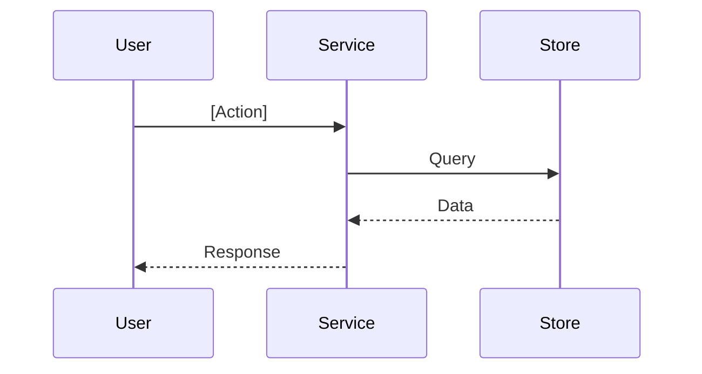

# [Feature]

## Navigation
- [Overview](./overview.md)
- [API](../../api/[module-slug]/api-[feature-slug].md)
- [Tests](../../testing/[module-slug]/test-[feature-slug].md)

## 1. Overview
- **Role:** [Position in arch]
- **Value:** [Business benefit]

## 2. User Stories
### US-[MOD]-[N] — [Title]
**As a** [role], **I want** [goal], **so that** [benefit].
- [ ] [Criteria 1]

## 3. Logic & Rules
### Flow

### Rules
- [Validation]
- [Domain constraint]

## 4. Model
```mermaid
erDiagram
    A { uuid id PK }
    B { uuid id PK; uuid a_id FK }
    A ||--o{ B : "has"
```

## 5. Tasks
| ID | Layer | Status | Desc |
|----|-------|--------|------|
| BE-01 | BE | Todo | Migration |
| BE-02 | BE | Todo | Logic |
| FE-01 | FE | Todo | UI |
