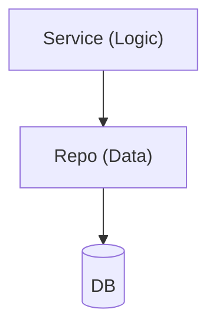

# [Module] Overview

## Navigation
- [Home](../../README.md)
- [Tests](../../testing/[slug]/overview.md)

## 1. Intro
- **Role:** [Core/Support]
- **Value:** [Benefit]

## 2. Features
| Feature | Desc | Doc |
|---------|------|-----|
| **[Name]** | [Desc] | [file.md](./file.md) |

## 3. Architecture

## 4. Dependencies
- **Store:** [DB/Cache]
- **External:** [APIs]
- **Internal:** [Modules]
