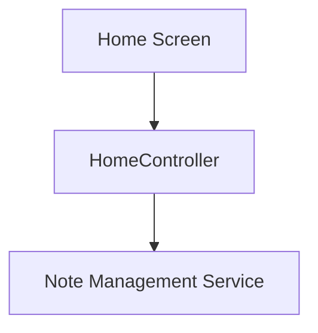

# Dashboard Overview

## Navigation
- [Overview](./overview.md)

## 1. Intro
- **Role:** Core Feature
- **Value:** Provides home screen with recent notes, quick actions, and system status.

## 2. Features
| Feature | Desc | Doc |
|---------|------|-----|
| **Home Screen** | Main dashboard with recent notes | [home_page.dart](../../../lib/features/dashboard/presentation/pages/home_page.dart) |

## 3. Architecture

## 4. Dependencies
- **Store:** Local state
- **Internal:** Notes, Recording

## 5. Navigation
- Route: `/` (default)
- Entry point for app launch