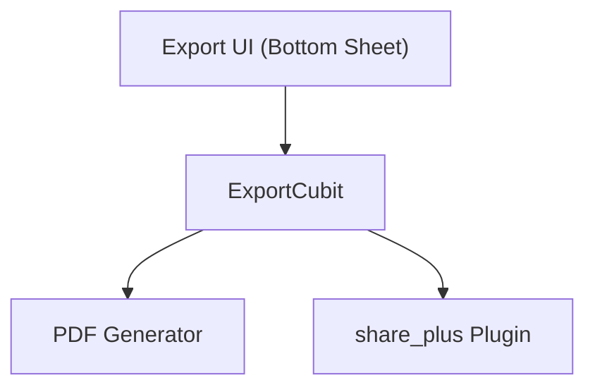

# Export Overview

## Navigation
- [Overview](./overview.md)
- [API](../../api/export/api-export.md)
- [Tests](../../testing/export/overview.md)

## 1. Intro
- **Role:** Feature (Utility)
- **Value:** Allows users to share their notes in professional formats.

## 2. Features
| Feature | Desc | Doc |
|---------|------|-----|
| **Export** | PDF/TXT generation & sharing | [export.md](./export.md) |

## 3. Architecture

## 4. Dependencies
- **Store:** Temp Files
- **External:** OS Share Sheet
- **Internal:** Storage, Recording
