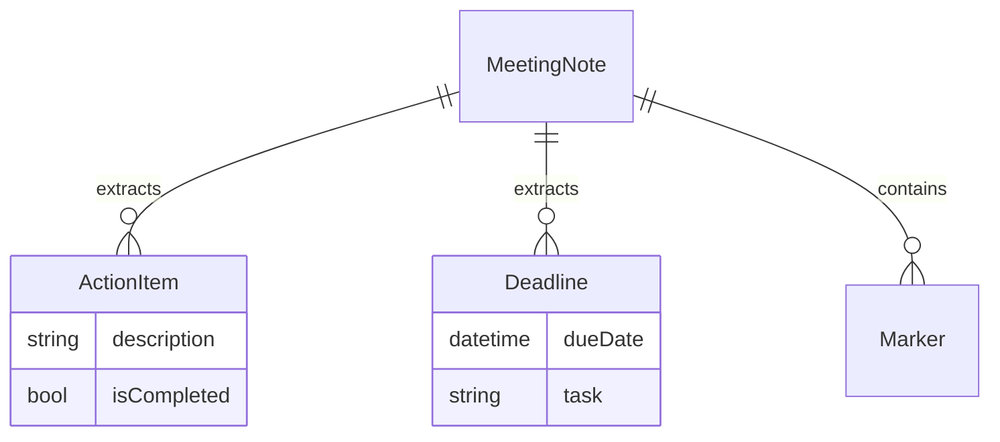
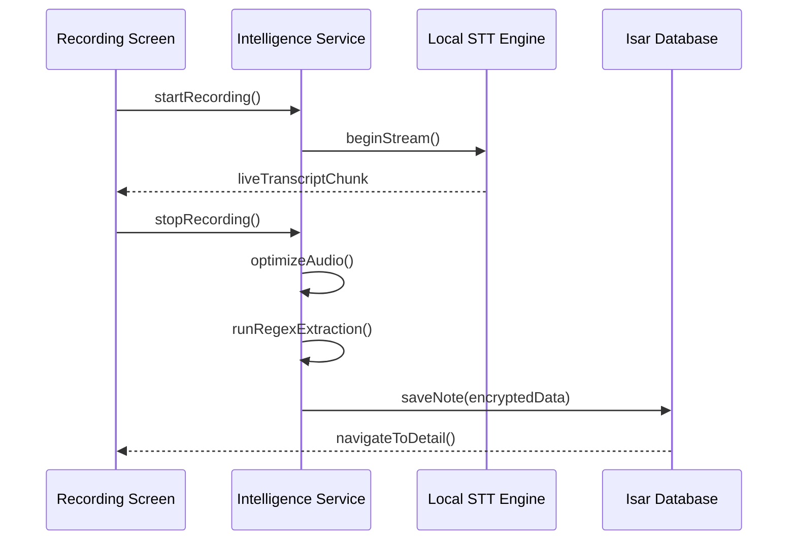

# Module Overview: Core Intelligence Engine

## 1. Overview
The **Intelligence Module** is responsible for transforming raw audio into structured information. It handles the transcription pipeline, audio optimization, and information extraction without any external network dependencies.

## 2. Data Model

## 3. Business Logic
### Extraction Pipeline
1. **Input**: Finalized transcript string from STT engine.
2. **Phase 1 (Redaction)**: Apply Regex patterns to identify PII (Emails, Phone Numbers) and replace with `[REDACTED]`.
3. **Phase 2 (Action Items)**: Scan for "imperative" keywords (e.g., "Must", "Action", "I will", "To do") at the start of sentences.
4. **Phase 3 (Deadlines)**: Match date/time patterns (e.g., "by Friday", "next week", "20/05/2025") relative to the meeting's `createdAt` timestamp.
5. **Output**: A collection of structured Domain Entities.

## 4. Sequence Diagram

## 5. Public Interface
### Classes
- `IntelligenceService`: Singleton managing the STT lifecycle and extraction isolates.
- `RegexParser`: Helper class containing the specific extraction rules.

### Methods
- `Future<NotePayload> processTranscript(String rawText)`: Runs the extraction pipeline in a background isolate.
- `Stream<String> listenToMic()`: Returns a real-time stream of transcribed words.

## 6. Dependencies
| Dependency | Role |
|------------|------|
| `speech_to_text` | OS-native offline transcription. |
| `vosk_flutter` | Backup/Pro STT engine for high-accuracy local models. |
| `dart:isolate` | Offloading heavy Regex parsing from UI thread. |

## 7. Limitations
- Accuracy is dependent on the quality of the device's microphone.
- Extraction rules are language-specific and require manual tuning for different dialects.
