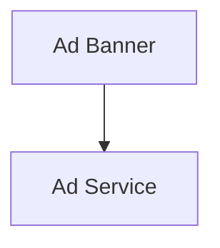

# Monetization Overview

## Navigation
- [Overview](./overview.md)

## 1. Intro
- **Role:** Supporting Feature
- **Value:** Handles ads and in-app purchase displays.

## 2. Features
| Feature | Desc | Doc |
|---------|------|-----|
| **Ad Banner** | Display in-app advertisements | [ad_banner.dart](../../../lib/features/monetization/presentation/widgets/ad_banner.dart) |

## 3. Architecture

## 4. Dependencies
- **External:** Ad networks
- **Internal:** None

## 5. Navigation
- Rendered within other screens (not a standalone route)