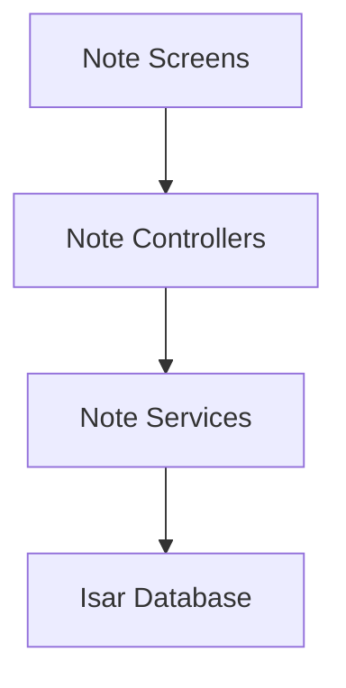

# Notes Overview

## Navigation
- [Overview](./overview.md)
- [API](../../api/notes/api-notes.md) *(to be created)*
- [Tests](../../testing/notes/overview.md) *(to be created)*

## 1. Intro
- **Role:** Core Feature
- **Value:** Manages meeting notes, versioning, folders, and search.

## 2. Features
| Feature | Desc | Doc |
|---------|------|-----|
| **Note List** | Display all notes | [note_list_controller.dart](./logic/note_list_controller.dart) |
| **Note Detail** | View/edit single note | [note_detail_screen.dart](./presentation/pages/note_detail_screen.dart) |
| **Versioning** | Track note changes | [versioning_service.dart](./services/versioning_service.dart) |
| **Folder Mgmt** | Organize notes | [folder_detail_controller.dart](./logic/folder_detail_controller.dart) |
| **Search** | Full-text search | [search_service.dart](./services/search_service.dart) |

## 3. Architecture

## 4. Dependencies
- **Store:** Isar Database
- **Internal:** Recording, Intelligence, Security
- **External:** None

## 5. Navigation
- Routes: `/notes`, `/notes/:id`, `/folders/:id`
- Accessed from: Dashboard, Recording