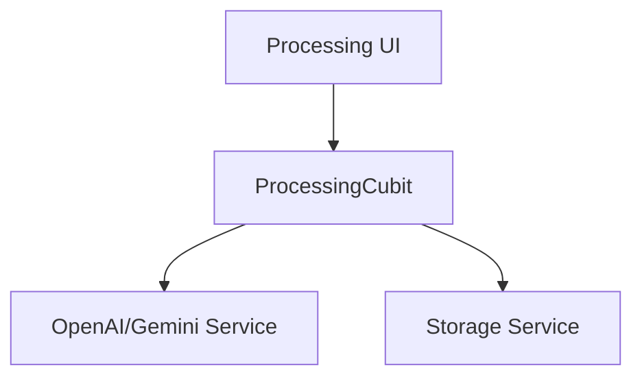

# Processing Overview

## Navigation
- [Overview](./overview.md)
- [API](../../api/processing/api-processing.md)
- [Tests](../../testing/processing/overview.md)

## 1. Intro
- **Role:** Feature (Utility)
- **Value:** Transforms raw audio/transcripts into usable data.

## 2. Features
| Feature | Desc | Doc |
|---------|------|-----|
| **AI Processing** | Transcription and highlight generation | [processing.md](./processing.md) |

## 3. Architecture

## 4. Dependencies
- **Store:** Isar Database
- **External:** LLM APIs
- **Internal:** Recording, Storage
