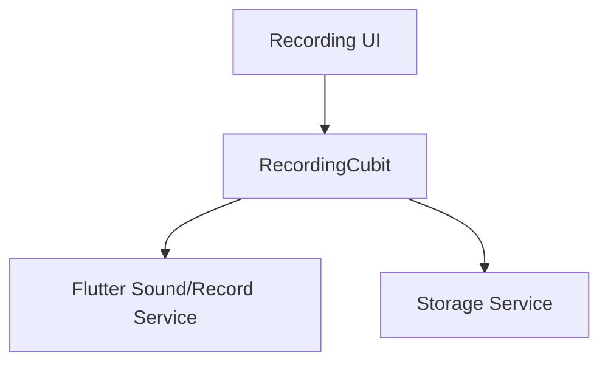

# Recording Overview

## Navigation
- [Overview](./overview.md)
- [API](../../api/recording/api-recording.md)
- [Tests](../../testing/recording/overview.md)

## 1. Intro
- **Role:** Core Feature
- **Value:** Captures audio data for processing and storage.

## 2. Features
| Feature | Desc | Doc |
|---------|------|-----|
| **Audio Capture** | Record high-quality audio | [recording.md](./recording.md) |

## 3. Architecture

## 4. Dependencies
- **Store:** Local Files (.m4a)
- **External:** OS Audio Permissions
- **Internal:** Storage
