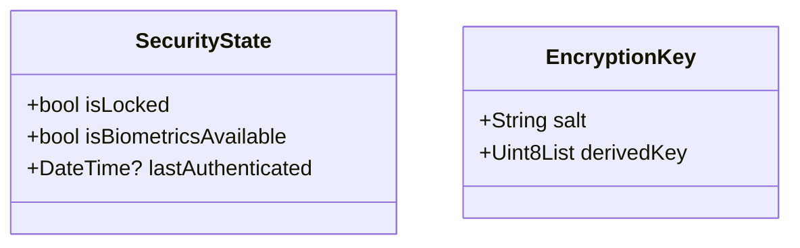
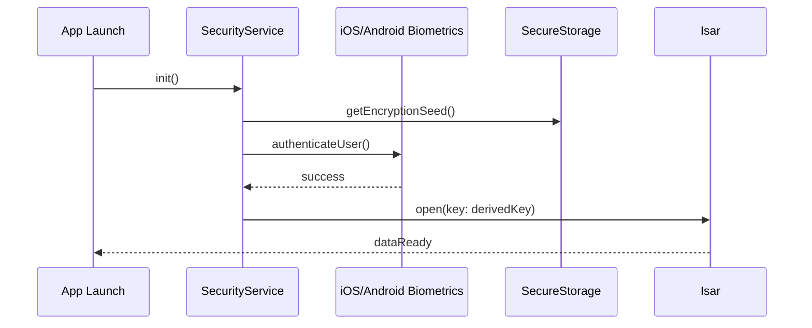

# Module Overview: Security & Safe-Box

## 1. Overview
The **Security Module** enforces the "Safe-Box" protocol. It manages biometric authentication, encryption key derivation, and secures the app's local storage against unauthorized access.

## 2. Data Model

## 3. Business Logic
### Unlock Sequence
1. User opens the app.
2. `SecurityService` checks `isSafeBoxEnabled` in secure storage.
3. If enabled, trigger `local_auth` biometric prompt.
4. On success, retrieve the AES-256 seed from the device's **KeyStore/Keychain**.
5. Pass the key to the `Isar` initialization method to decrypt the local database.

## 4. Sequence Diagram

## 5. Public Interface
### Classes
- `SafeBoxGuard`: Cubit/Bloc managing the lock/unlock UI states.
- `KeyDerivator`: Utility for generating keys from seeds and biometric tokens.

### Methods
- `Future<bool> authenticate()`: Triggers biometric UI.
- `Future<void> enableSafeBox(bool enable)`: Toggles encryption status and generates keys if needed.

## 6. Dependencies
| Dependency | Role |
|------------|------|
| `local_auth` | OS Biometric API (TouchID/FaceID/Fingerprint). |
| `flutter_secure_storage` | Hardware-backed key storage. |
| `isar` | Database encryption logic. |

## 7. Limitations
- If a user loses access to biometrics (e.g., hardware failure) and hasn't backed up their master seed, data is unrecoverable.
- Rooted/Jailbroken devices may bypass certain hardware-level protections.
