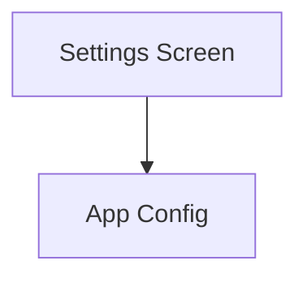

# Settings Overview

## Navigation
- [Overview](./overview.md)

## 1. Intro
- **Role:** Supporting Feature
- **Value:** Handles app configuration, preferences, and STT model status.

## 2. Features
| Feature | Desc | Doc |
|---------|------|-----|
| **Settings Screen** | Main settings UI | [settings_screen.dart](../../../lib/features/settings/presentation/pages/settings_screen.dart) |
| **STT Model Status** | Display speech model info | [stt_model_status.dart](../../../lib/features/settings/presentation/widgets/stt_model_status.dart) |

## 3. Architecture

## 4. Dependencies
- **Store:** Secure Storage
- **Internal:** Intelligence (STT)

## 5. Navigation
- Route: `/settings`