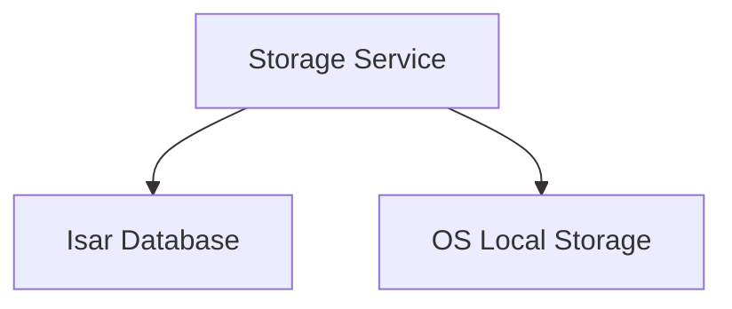

# Storage Overview

## Navigation
- [Overview](./overview.md)
- [API](../../api/storage/api-storage.md)
- [Tests](../../testing/storage/overview.md)

## 1. Intro
- **Role:** Core Infrastructure
- **Value:** Ensures all data is persisted and accessible.

## 2. Features
| Feature | Desc | Doc |
|---------|------|-----|
| **Data Persistence** | Local database and file management | [storage.md](./storage.md) |

## 3. Architecture

## 4. Dependencies
- **Store:** Isar Database, Local Filesystem
- **External:** Path Provider
- **Internal:** N/A
