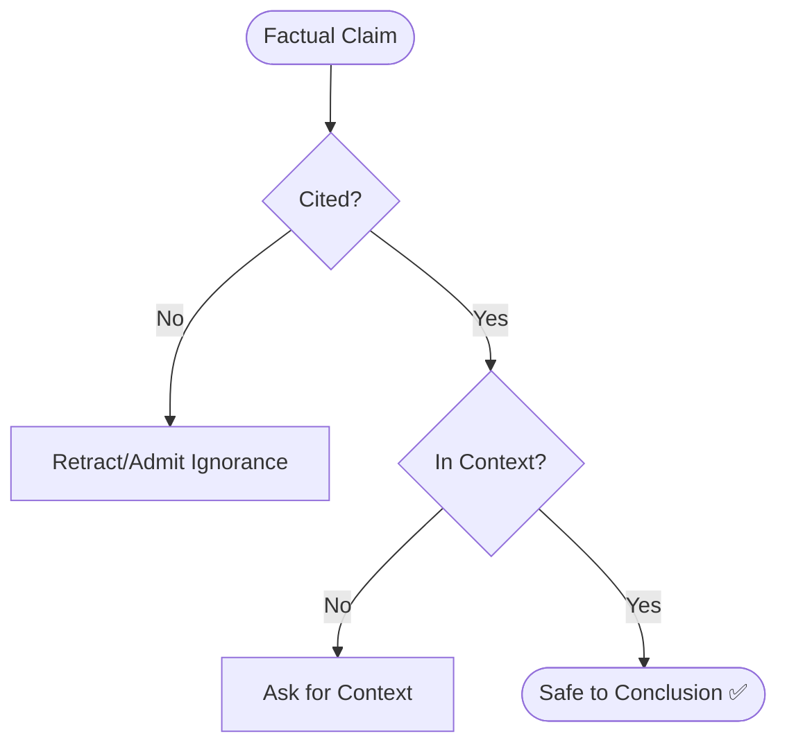

# Anti-Hallucination Rules (Agent Optimized)

## 1. Core Directives (MANDATORY)

- **Uncertainty**: Say "I don't know" or "I'm not certain". Never fabricate or guess silently.
- **Citation**: Find and cite a source (code snippet, doc, or spec) BEFORE claiming a fact. No source = No claim.
- **Context Only**: Use ONLY provided information. Do not assume framework defaults or general knowledge.
- **Reasoning (CoT)**: For debugging/planning, show step-by-step reasoning based on evidence BEFORE concluding.
- **Scope**: Stay within defined module/file boundaries. Ask explicitly for out-of-scope context.

## 2. Forbidden Patterns (❌)

- Faking versions, dates, metrics, or function names.
- Inferring rules or behaviors not stated in docs.
- Generating realistic "example" data (use placeholders like `PLACEHOLDER_NAME`).

## 3. Sequential Thinking (MANDATORY)

Before complex tasks (planning, architecture, gap analysis):
1. **Sync State**: Load `@.agents/documents/` and existing context.
2. **Think**: Use CoT to map knowns vs. unknowns and risks.
3. **Reason**: Document approach before executing.

## 4. Verification Flow

