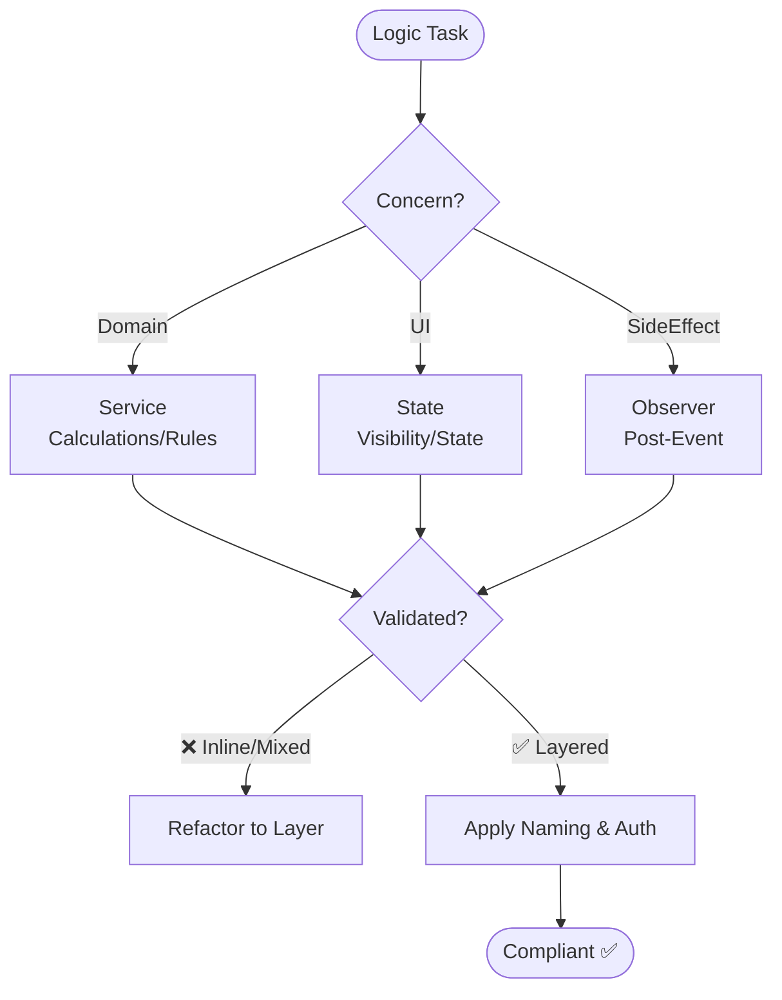

# Business Logic & Architecture (Agent Optimized)

## 1. Layer Responsibilities (STRICT)

| Layer | MUST Handle | MUST NOT Handle |
| :--- | :--- | :--- |
| **Service** | Domain calcs, business rules, cross-entity ops, action handlers (`*Action` suffix). | UI visibility, component state, DB constraints, HTTP handling. |
| **State** | UI visibility, form callbacks, options/choices, component state. | Business calcs, domain rules, DB ops, cross-entity logic. |
| **Observer** | Side effects (post-save/delete), related record updates, external events. | User actions, UI logic, request validation, auth. |

## 2. Patterns & Mandates

- **Service Actions**: Static methods returning callbacks only. `button.onClick(OrderService.approveAction())`.
- **Authorization**: Use Policy/Guard. Null-safe check required: `currentUser?.can('action', record)`.
- **Naming**: Action handlers MUST use `Action` suffix (e.g., `submitAction`).
- **Logic Extraction**: Extract ALL logic from controllers/closures into Services (Domain) or State (UI).

## 3. Forbidden Practices (❌)

- Business logic in Controllers, Route Handlers, or Inline Closures.
- UI logic in Service classes.
- DB queries in State classes or UI components.
- User-initiated actions in Observers.
- `new Service()` in callers (use static methods).
- Authorization without null-safe checks.

## 4. Flow Validation

