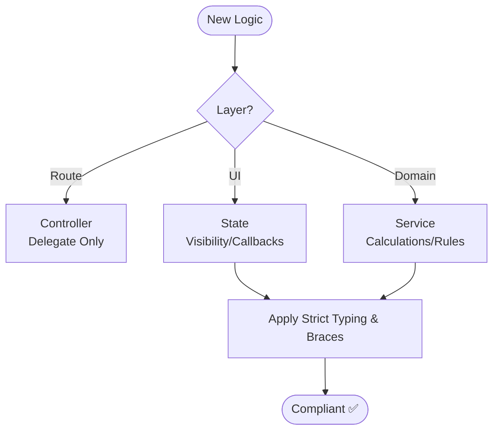

# Coding Standards (Agent Optimized)

## 1. Logic Placement (STRICT)

| Layer | Responsibility | Rule |
| :--- | :--- | :--- |
| **1: Controller** | Route Handlers / Delegation | Thin, no business logic. |
| **2: State** | UI Logic, Visibility, Callbacks | Extracted from UI components. |
| **3: Service** | Business Logic, Domain Rules | MUST handle calcs and rules. |
| **4: Observer** | Side Effects, Post-Event Hooks | Automated updates/actions. |
| **5: Database** | Persistence, Integrity, Cascades | Enforce constraints. |

## 2. Core Directives (MANDATORY)

- **Strict Typing**: No `any`. Explicit params/returns. Use interfaces for complex types.
- **Naming**: Enums/Constants: `TitleCase` keys, `slug-case` values. ❌ `snake_case`.
- **Braces**: Always use `{}` for control structures (e.g., `if (x) { y(); }`).
- **UI Logic**: Extracted to State/Service. No inline logic beyond simple expressions.
- **Standards**: Run `type-check → lint → format` after EVERY modification.

## 3. Forbidden Practices (❌)

- Business/Domain logic in Controllers, Route Handlers, or UI components.
- Inline closures containing domain/business logic.
- Hardcoded user-facing strings (use i18n).
- Magic numbers without named constants.

## 4. Hierarchy Flow

