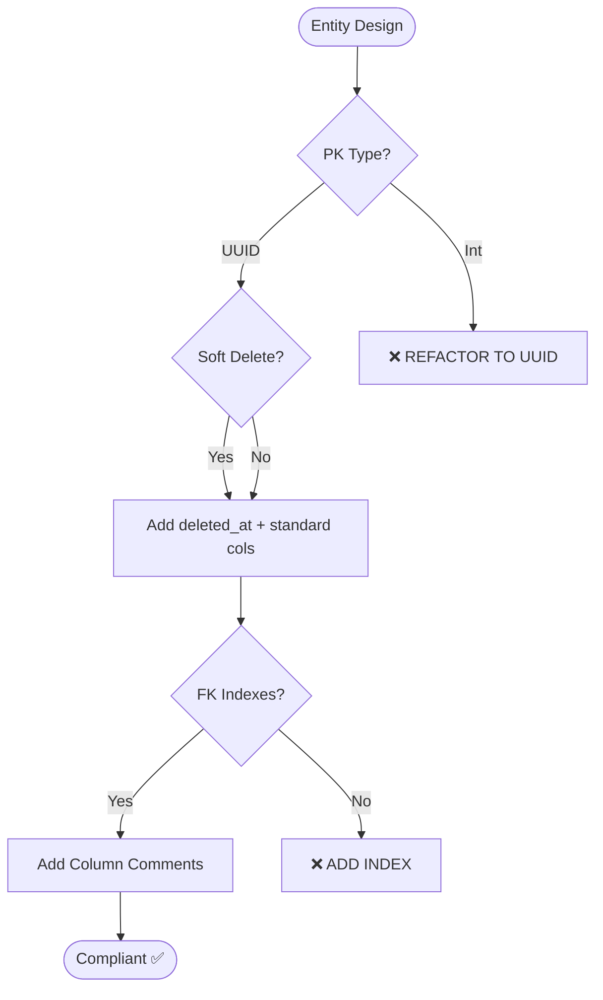

# Database Standards (Agent Optimized)

## 1. Schema Mandates (STRICT)

- **Primary Keys**: MUST use `UUID`. ❌ No auto-increment for business entities.
- **Soft Delete**: `deleted_at` column for all business entities. Cascade automatically.
- **Standard Columns**: `id (UUID)`, `created_at`, `updated_at`, `deleted_at`.
- **Indexing**: Every Foreign Key MUST have an index.
- **Documentation**: All columns MUST have descriptive comments in migrations.

## 2. Data Types & Precision

| Data Type | Purpose | Precision |
| :--- | :--- | :--- |
| **decimal** | Currency, Price, Quantities | `15, 2` |
| **uuid** | IDs, Foreign Keys | N/A |
| **string** | Codes, Enums, Short text | Max 255 |
| **json** | Metadata, Settings | N/A |

**FORBIDDEN**: `float` / `double` for monetary values (use `decimal`).

## 3. Forbidden Practices (❌)

- Foreign keys without an index.
- Tables without `timestamps` or `soft_delete` (unless technical/log data).
- Modifying columns without complete attribute specification (nullability, defaults).
- Non-singular/non-snake_case foreign keys (`{entity}_id`).

## 4. Design Flow

