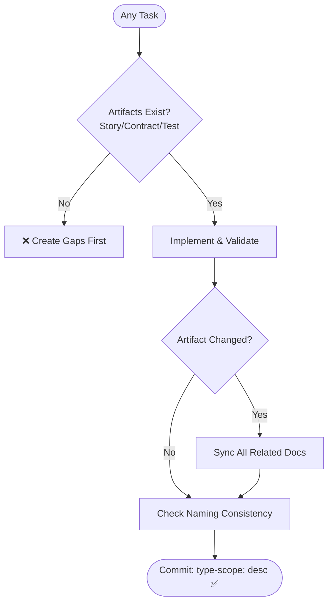

# Development Quality (Agent Optimized)

## 1. Required Artifacts (STRICT)

Every feature is INCOMPLETE until these exist:

| Artifact | Purpose | Mandatory Components |
| :--- | :--- | :--- |
| **User Story** | Value | Role, Goal, Benefit (As a... I want... so that...). |
| **Contract** | Interface | Defined Inputs, Outputs, and Error Cases. |
| **Tests** | Validation | Min 1 Positive + 1 Negative test per function/route. |

## 2. Process Mandates

- **Sync Check**: If logic/contract changes, update ALL related artifacts immediately.
- **Documentation First**: Read User Stories, API Contracts, and ERDs BEFORE coding.
- **Naming Consistency**: DB = API = Docs = Code. No casing differences or synonyms.
- **Atomic Commits**: `type(scope): description`.

## 3. Commit Types

| Type | Use Case |
| :--- | :--- |
| `feat` / `fix` | New feature or bug fix. |
| `docs` / `test` | Documentation or test changes. |
| `refactor` | Code change without behavior change. |
| `chore` | Maintenance or dependency updates. |

## 4. Quality Gate Flow

