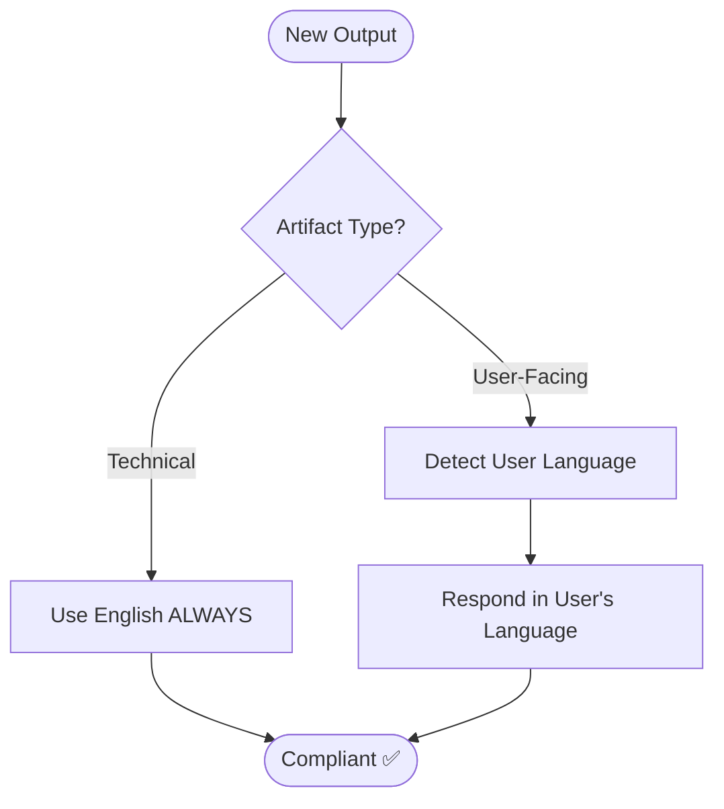

# Language Policy (Agent Optimized)

## 1. Context Language Mapping

| Target | Language | Examples |
| :--- | :--- | :--- |
| **Technical** | **English** | Code, comments, file names, docs, git messages. |
| **Communication** | **User's Language** | Chats, questions, gates, error explanations. |

## 2. Core Directives

- **English Mandatory**: All technical artifacts (code, variables, markdown docs) MUST be in English. No exceptions.
- **Dynamic Response**: Detect user's language from their latest message. Switch immediately if they switch.
- **Fallback**: Default to English if user language is ambiguous.

## 3. Compliance Flow

