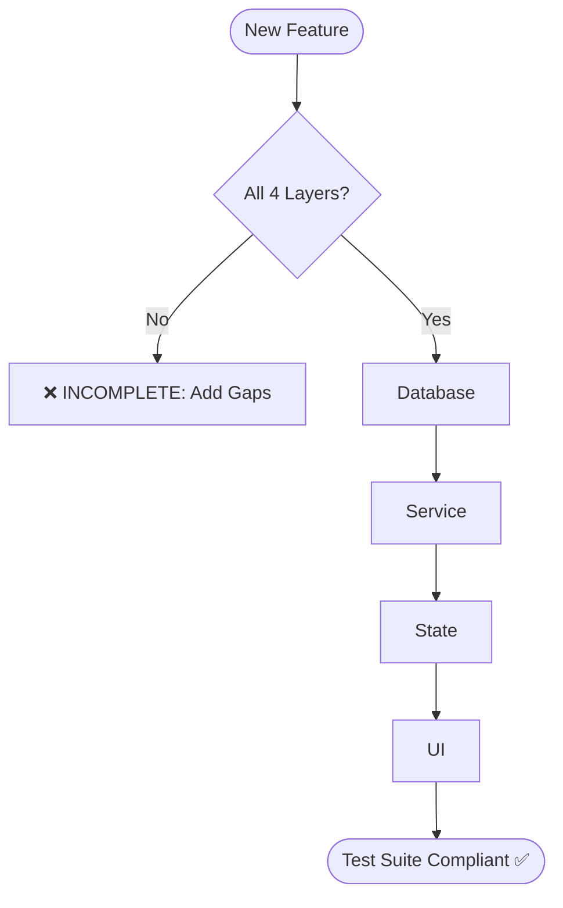

# Test Architecture (Agent Optimized)

## 1. The 4-Concern Rule (MANDATORY)

Every feature is INCOMPLETE until these 4 test layers exist:

| Layer | MUST Test | MUST NOT Test |
| :--- | :--- | :--- |
| **1: Database** | Integrity, FKs, Unique indexes, Cascades, Defaults. | Business rules, UI logic. |
| **2: Service** | Domain calcs, business rules, action outcomes. | DB constraints, UI validation. |
| **3: State** | Status transitions, guards, workflow rules. | DB integrity, UI rendering. |
| **4: UI** | Form validation, events, auth checks, modals. | Business calcs, DB logic. |

## 2. Execution & Design Rules

- **Execution Order**: Database → Service → State → UI. Success in one depends on the previous.
- **Duplication Ban**: Assert a rule in only ONE concern. Priority: DB > Service > State > UI.
- **Naming**: Use **Domain Entity Name** for test directories (e.g., `tests/services/procurement/purchase-order/`).
- **Isolation**: Every test MUST be deterministic and isolated (use transactions/fixtures).
- **Compliance**: No skipping layers. Every test must reference docs/spec.

## 3. Forbidden Practices (❌)

- Testing business logic in UI tests.
- Testing UI validation in Service tests.
- Testing database integrity in State tests.
- Duplicate assertions across multiple concerns.
- Tests that depend on execution order of other tests.

## 4. Architecture Flow

