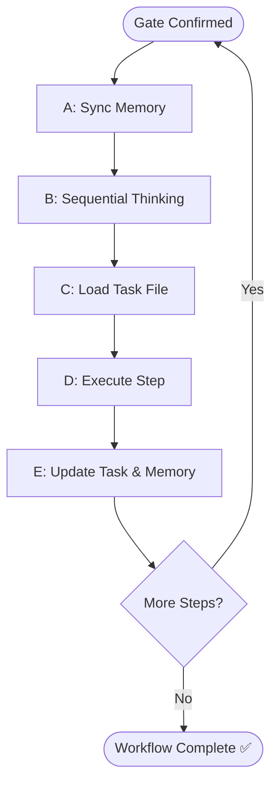

# Workflow Execution (Agent Optimized)

## 1. Pre-Execution Protocol (MANDATORY)

Execute this sequence AFTER every gate/user confirmation and BEFORE any action:

| Step | Action | Tool / Method |
| :--- | :--- | :--- |
| **A: Sync** | Load dynamic memory. | `memory-recap` or `memory-search`. |
| **B: Think** | Sequential thinking. | `sequential-thinking` (Next step, risks, assumptions). |
| **C: Load** | Read current task file. | `@.agents/documents/_tasks/{workflow-slug}.md`. |
| **D: Act** | Execute next step. | Per task file instructions. |
| **E: Log** | Update Memory & Task. | `memory-store` + update `[x]` in task file. |

## 2. Task Management Mandates

- **Creation**: Create task file BEFORE Step 1 using `task-management` skill.
- **Maintenance**: Update after EVERY step (mark `[x]`) and gate (log decision).
- **Communication**: ALWAYS use `ask_user` for confirmation gates. No plain-text options.
- **Context Carry**: Pass full chain of prior outputs (`{{context}}`) to every skill invocation.

## 3. Forbidden Practices (❌)

- **Phase Skipping**: Never skip steps without explicit user confirmation via `ask_user`.
- **Ad-hoc Saving**: Never save to ad-hoc paths. Use defined paths in `AGENTS.md`.
- **Silent Diagnosis**: Never diagnose gaps without loading ALL current context docs first.
- **Memory Reliance**: Never rely on chat history; ALWAYS read the task file at session start.

## 4. Documentation References

- Reference docs using `@` prefix (e.g., `@.agents/documents/requirements/brd/slug.md`).
- Always load `design/`, `requirements/`, and `tasks/` before performing gap analysis.

## 5. Execution Flow

