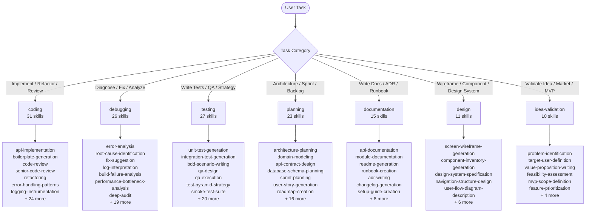

# AI Dev Toolkit — Skills

A collection of 144 AI skills for developers, organized across 7 categories. Each skill contains structured instructions compatible with 7 IDEs/agents: Kiro, Cursor, Windsurf, GitHub Copilot, OpenCode, TRAE, Claude Code.

## Categories

| Category | Skills | Subdirectories |
|----------|--------|----------------|
| [coding](coding/) | 31 | `scripts/` `references/` `assets/` `examples/` |
| [debugging](debugging/) | 26 | `references/` `examples/` |
| [testing](testing/) | 27 | `scripts/` `references/` `assets/` `examples/` |
| [planning](planning/) | 23 | `references/` `assets/` `examples/` |
| [documentation](documentation/) | 15 | `references/` `assets/` `examples/` |
| [design](design/) | 11 | `references/` `assets/` `examples/` |
| [idea-validation](idea-validation/) | 10 | `references/` `assets/` `examples/` |

## Subdirectory Structure

### Full Stack (coding & testing)
```
{skill-name}/
├── SKILL.md          # Core instructions (≤500 lines)
├── scripts/          # Executable scripts and automation
├── references/       # Supporting technical documentation
├── assets/           # Ready-to-use templates and configurations
└── examples/         # Concrete input/output examples
```

### Standard (planning, documentation, design, idea-validation)
```
{skill-name}/
├── SKILL.md
├── references/
├── assets/
└── examples/
```

### Minimal (debugging)
```
{skill-name}/
├── SKILL.md
├── references/
├── assets/        # (optional — only for skills that provide templates)
└── examples/
```

## Contributing

To create a new skill, use the scaffold generator:

```bash
bash scripts/generate-skill-scaffold.sh <category> <skill-name>
# Example:
bash scripts/generate-skill-scaffold.sh coding my-new-skill
```

Valid categories: `coding`, `debugging`, `testing`, `planning`, `documentation`, `design`, `idea-validation`

## Validation

To validate the structure of all skills:

```bash
bash scripts/validate-skill-structure.sh
# Exit code 0 = all skills compliant
# Exit code 1 = one or more skills non-compliant

# Filter by category:
bash scripts/validate-skill-structure.sh --category coding
```

## Compatibility

All skills are compatible with:

| Agent | Path |
|-------|------|
| Kiro | `.kiro/skills/` |
| Cursor | `.cursor/skills/` |
| Windsurf | `.windsurf/skills/` |
| GitHub Copilot | `.github/skills/` |
| OpenCode | `.agents/skills/` |
| TRAE | `.trae/skills/` |
| Claude Code | `.claude/skills/` |

---

## Mermaid Diagram


