# Skills: Coding (31 skills)

This category contains skills for code implementation, refactoring, and automation.

## Subdirectory Structure

Each skill in the `coding` category has the following structure:

```
{skill-name}/
├── SKILL.md          # Core instructions (≤500 lines)
├── scripts/          # Executable scripts and automation
│   ├── README.md
│   └── run.sh        # (for automation skills)
├── references/       # Supporting technical documentation
│   ├── README.md
│   └── compatibility-matrix.md
├── assets/           # Ready-to-use templates and configurations
│   └── template.md
└── examples/         # Concrete input/output examples
    ├── input.md
    └── output.md
```

## Skills

| Skill | Description |
|-------|-------------|
| `api-implementation` | Implement REST/GraphQL endpoints end-to-end |
| `background-job-queue-worker` | Background jobs and queue workers |
| `boilerplate-generation` | Generate boilerplate code for new projects |
| `caching-strategy-implementation` | Implement caching strategies |
| `ci-cd-pipeline-scripting` | Generate CI/CD pipeline configurations |
| `code-generation` | Generate code from specifications |
| `code-migration` | Migrate code between frameworks/versions |
| `code-review` | Review code with structured feedback |
| `configuration-management` | Application configuration management |
| `database-query-optimization` | Optimize database queries |
| `dependency-upgrade` | Safely upgrade dependencies |
| `design-pattern-application` | Apply design patterns |
| `dockerfile-containerization` | Containerize applications with Docker |
| `environment-setup` | Set up development environments |
| `error-handling-patterns` | Implement error handling patterns |
| `feature-flag-implementation` | Implement feature flags |
| `graphql-schema-generation` | Generate GraphQL schemas |
| `infrastructure-as-code` | Write infrastructure as code |
| `interface-contract-implementation` | Implement interface contracts |
| `logging-instrumentation` | Add structured logging and instrumentation |
| `monorepo-setup` | Set up monorepo structures |
| `openapi-spec-generation` | Generate OpenAPI specifications |
| `pagination-implementation` | Implement pagination |
| `performance-optimization` | Optimize application performance |
| `php-post-write` | Auto-run type checker + linter + formatter after writing code |
| `rate-limiting` | Implement rate limiting |
| `refactoring` | Refactor existing code |
| `rest-to-graphql-migration` | Migrate REST APIs to GraphQL |
| `sdk-library-integration` | Integrate SDKs and libraries |
| `senior-code-review` | Senior-level code review |
| `tech-stack-guidelines` | Architecture blueprints for 13 tech stacks |
| `webhook-handler` | Implement webhook handlers |

---

## Mermaid Diagram

```mermaid
flowchart TD
    A([Coding Task]) --> B{What do you need?}

    B -- New project scaffold --> C[boilerplate-generation]
    B -- Implement API endpoints --> D[api-implementation]
    B -- Generate code from spec --> E[code-generation]
    B -- Implement interface/contract --> F[interface-contract-implementation]
    B -- Review code --> G{Review depth?}
    G -- Standard --> H[code-review]
    G -- Senior / production-readiness --> I[senior-code-review]
    B -- Refactor existing code --> J[refactoring]
    B -- Error handling --> K[error-handling-patterns]
    B -- Logging / observability --> L[logging-instrumentation]
    B -- Background jobs / queues --> M[background-job-queue-worker]
    B -- Caching --> N[caching-strategy-implementation]
    B -- Webhooks --> O[webhook-handler]
    B -- Third-party SDK --> P[sdk-library-integration]
    B -- Pagination --> Q[pagination-implementation]
    B -- Rate limiting --> R[rate-limiting]
    B -- Feature flags --> S[feature-flag-implementation]
    B -- GraphQL schema --> T[graphql-schema-generation]
    B -- OpenAPI spec --> U[openapi-spec-generation]
    B -- Design patterns --> V[design-pattern-application]
    B -- Docker --> W[dockerfile-containerization]
    B -- CI/CD pipeline --> X[ci-cd-pipeline-scripting]
    B -- Infrastructure as Code --> Y[infrastructure-as-code]
    B -- Monorepo --> Z[monorepo-setup]
    B -- DB query optimization --> AA[database-query-optimization]
    B -- Performance --> AB[performance-optimization]
    B -- Migrate code --> AC[code-migration]
    B -- REST to GraphQL --> AD[rest-to-graphql-migration]
    B -- Upgrade dependencies --> AE[dependency-upgrade]
    B -- Environment setup --> AF[environment-setup]
    B -- Config management --> AG[configuration-management]
    B -- Tech stack guidelines --> AH[tech-stack-guidelines]
```


