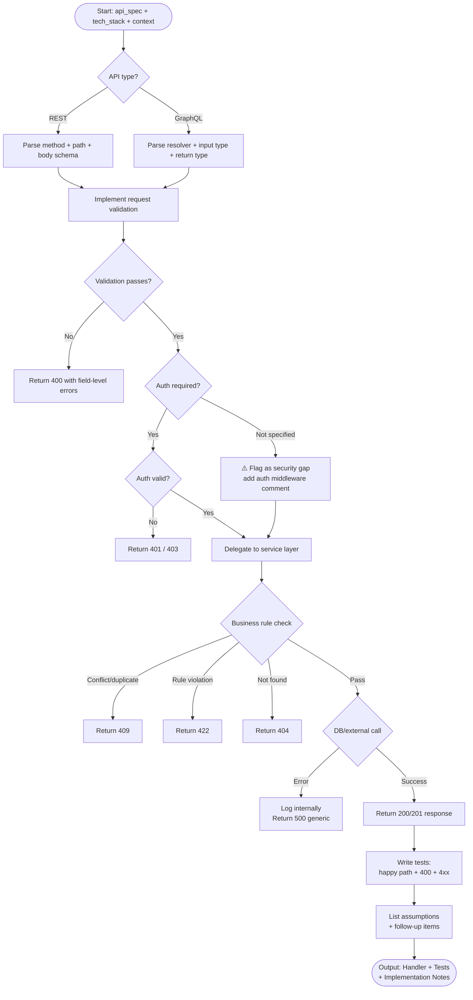

# Skill: API Implementation

## Purpose
Implement a complete production-ready API endpoint (REST/GraphQL) from specification, including handler/resolver, validation, error handling, and tests.

## Input
| Variable | Type | Req | Description |
|----------|------|-----|-------------|
| `tech_stack` | string | Yes | Target stack (e.g., "Node.js + Express + Zod") |
| `api_spec` | string | Yes | Method, path, schema, responses, rules |
| `context` | string | Yes | Project conventions, auth, models, error format |

## Instructions
- **Request Validation**: Use idiomatic tools (Zod, Pydantic, etc.). Return 400 on failure with field-level details.
- **Business Logic**: Keep handlers thin; delegate to service/repository layers.
- **Error Handling**: Map errors to standard codes (400, 401/403, 404, 409, 422, 500).
- **Testing**: Implement at least three cases: Happy path, Validation failure, and Resource not found/Conflict.
- **Documentation**: List assumptions and follow-up items (caching, rate limiting) after the code.

## Edge Cases
| Case | Strategy |
|------|----------|
| Underspecified spec | Implement common interpretation; list all assumptions. |
| Auth missing | Flag as security gap; add implementation comments. |
| Complex logic | Wrap in database transactions; ensure atomicity. |

## Refactoring Logic

## Examples
- [Input Example](@examples/input.md)
- [Output Example](@examples/output.md)

## Quality Gate
1. Is the solution the simplest possible?
2. Are failure modes handled (4xx/5xx)?
3. Does it scale 10x in load/size?
4. Are security implications addressed?
5. is it testable and observable?

## MCP Dependencies
- `@upstash/context7-mcp`: Library documentation and examples.

## Changelog
| Version | Date | Description |
|---------|------|-------------|
| 1.1.0 | 2026-03-20 | Restructured: moved examples to examples/, references to references/, added compatibility and license fields |
| 1.0.0 | 2026-03-20 | Initial release |
