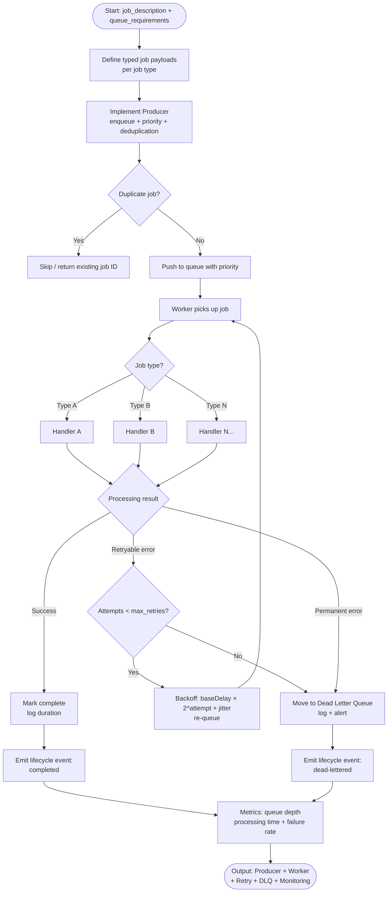

# Skill: Background Job Queue Worker

## Purpose
Implement a reliable async processing pipeline including producer (enqueue), worker (process), exponential backoff retries, dead letter queue (DLQ), and monitoring.

## Input
| Variable | Type | Req | Description |
|----------|------|-----|-------------|
| `tech_stack` | string | Yes | App stack + queue tech (e.g., "Node.js + BullMQ + Redis") |
| `job_description` | string | Yes | Job types, payload structure, processing logic, volume |
| `queue_requirements` | string | Yes | Retries, delay strategy, timeout, concurrency, priority |

## Instructions
- **Job Definitions**: Define typed payloads with schemas and expected timeouts.
- **Producer**: Implement type-safe enqueueing with priority, scheduling, and deduplication.
- **Worker**: Create handlers with structured logging, timeout enforcement, and graceful shutdown.
- **Retry Strategy**: Implement exponential backoff (`delay = base * 2^attempt + jitter`). Distinguish retryable vs. permanent errors; move to DLQ on exhaustion.
- **Monitoring**: Add observability for lifecycle events (enqueued to dead-lettered) and metrics (depth, duration, failure rate).

## Edge Cases
| Case | Strategy |
|------|----------|
| Large payload | Store in S3/DB; pass reference ID in job message. |
| Worker crash | Use `acks_late` or persistent state to ensure job re-queuing. |
| Backpressure | Reject new jobs with 503 if queue depth exceeds threshold. |

## Execution Flow

## Examples
- [Input Example](@examples/input.md)
- [Output Example](@examples/output.md)

## Quality Gate
1. Is the solution the simplest possible?
2. Are failure modes (retries/DLQ) handled?
3. Does it scale 10x in load/size?
4. Are security implications addressed?
5. Is the output testable and observable?

## MCP Dependencies
- `@upstash/context7-mcp`: Library documentation and examples.

## Changelog
| Version | Date | Description |
|---------|------|-------------|
| 1.1.0 | 2026-03-20 | Restructured: moved examples to examples/, references to references/, added compatibility and license fields |
| 1.0.0 | 2026-03-20 | Initial release |
