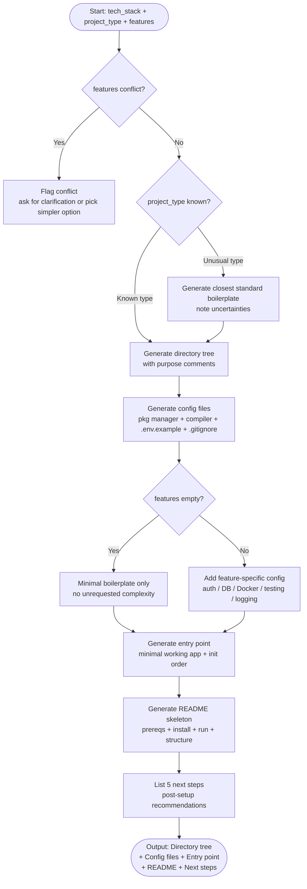

# Skill: Boilerplate Generation

## Purpose
Generate a production-ready project boilerplate including directory structure, config files, entry points, and README skeleton for any tech stack.

## Input
| Variable | Type | Req | Description |
|----------|------|-----|-------------|
| `tech_stack` | string | Yes | Target stack (e.g., "Node.js + TypeScript + Express") |
| `project_type` | string | Yes | e.g., "REST API", "CLI tool", "npm library" |
| `features` | string | Yes | e.g., "auth, database, logging, Docker, testing" |

## Instructions
- **Directory Structure**: Provide a tree with purpose comments for each directory/key file.
- **Configuration**: Generate content for package managers, compilers, `.env.example`, and editor configs (`.gitignore`).
- **Entry Point**: Create a minimal working application with proper initialization order (Config → DB → Middleware → Routes).
- **README**: Include a skeleton covering description, prerequisites, setup, local run, and test commands.
- **Next Steps**: Provide a numbered list of 5 immediate post-setup recommendations.

## Edge Cases
| Case | Strategy |
|------|----------|
| Unusual project type | Generate closest standard boilerplate; note uncertainties. |
| Feature conflict | Flag conflict; ask for clarification or prioritize simplicity. |
| Minimal features | Generate essentials only; avoid unrequested complexity. |

## Workflow

## Examples
- [Input Example](@examples/input.md)
- [Output Example](@examples/output.md)

## Quality Gate
1. Is the solution the simplest possible?
2. Are failure modes handled?
3. Does it scale 10x in load/size?
4. Are security implications addressed?
5. is it testable and observable?

## MCP Dependencies
- `@upstash/context7-mcp`: Library documentation and examples.

## Changelog
| Version | Date | Description |
|---------|------|-------------|
| 1.1.0 | 2026-03-20 | Restructured: moved examples to examples/, references to references/, added compatibility and license fields |
| 1.0.0 | 2026-03-20 | Initial release |
