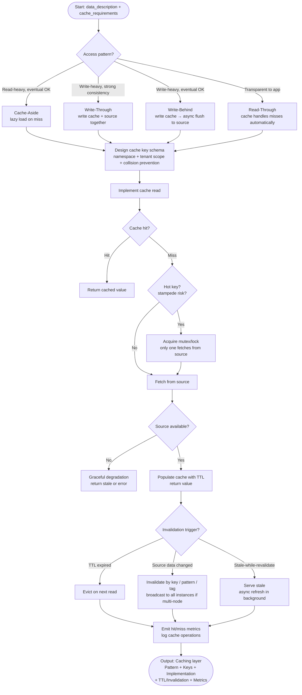

# Skill: Caching Strategy Implementation

## Purpose
Implement a caching layer (cache-aside, write-through, etc.) to optimize data access while maintaining consistency.

## Input
| Variable | Type | Req | Description |
|----------|------|-----|-------------|
| `tech_stack` | string | Yes | App stack + cache tech (e.g., "Node.js + Redis") |
| `data_description` | string | Yes | Data source, access patterns, consistency requirements |
| `cache_requirements` | string | Yes | TTL, invalidation triggers, size limits, consistency level |

## Instructions
- **Pattern Selection**: Select and justify a pattern (Cache-aside, Write-through, Write-behind, Read-through) based on access patterns.
- **Key Design**: Define a namespaced, collision-resistant key schema (include tenant/user scope).
- **Implementation**: Code the read/write logic with TTL, invalidation (key/pattern/tag), and stampede prevention (mutex/locks). Ensure graceful degradation if the cache is down.
- **Invalidation**: Define TTL rationale and event-driven invalidation triggers.
- **Monitoring**: Add hit/miss metrics and operational logging.

## Edge Cases
| Case | Strategy |
|------|----------|
| Multi-instance | Use Redis pub/sub or tags to broadcast invalidation. |
| Large objects | Apply compression (gzip/msgpack) or split entries. |
| Cold starts | Implement cache warming for hot keys on startup. |

## Logical Flow

## Examples
- [Input Example](@examples/input.md)
- [Output Example](@examples/output.md)

## Quality Gate
1. Is the solution the simplest possible?
2. Are failure modes (cache down) handled?
3. Does it scale 10x in load/size?
4. Are security implications addressed?
5. Is the output testable and observable?

## MCP Dependencies
- `@upstash/context7-mcp`: Library documentation and examples.

## Changelog
| Version | Date | Description |
|----------|------|-------------|
| 1.1.0 | 2026-03-20 | Restructured: moved examples to examples/, references to references/, added compatibility and license fields |
| 1.0.0 | 2026-03-20 | Initial release |
