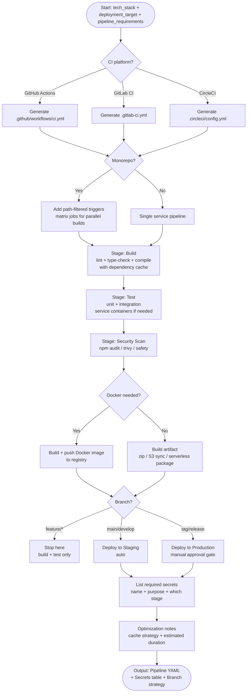

# Skill: CI/CD Pipeline Scripting

## Purpose
Generate production-ready CI/CD configurations (GitHub Actions, GitLab CI, etc.) for any stack and deployment target, including caching, security scans, and environment promotion.

## Input
| Variable | Type | Req | Description |
|----------|------|-----|-------------|
| `tech_stack` | string | Yes | App stack (e.g., "Node.js + Docker") |
| `deployment_target` | string | Yes | e.g., "AWS ECS", "Kubernetes", "Vercel" |
| `pipeline_requirements` | string | Yes | Platform, environments, tests, branch strategy |

## Instructions
- **Stages**: Define Build (lint/compile), Test (unit/integration), Security (scan vulnerabilities), and Deploy (environment-specific gates).
- **Configuration**: Generate the YAML/config file with dependency caching and artifact creation.
- **Secrets**: Provide a table of required secrets (Name, Purpose, Source).
- **Branch Strategy**: Define triggers (feature branches = build/test; main = staging; tags = production).
- **Optimization**: Include notes on caching efficiency and estimated duration.

## Edge Cases
| Case | Strategy |
|------|----------|
| Monorepo | Use path-filtered triggers and parallel matrix builds. |
| Non-Docker deployment | Generate artifact-based logic (S3 sync, serverless package). |
| Self-hosted runners | Add runner tags and credential mounting requirements. |

## Pipeline Flow

## Examples
- [Input Example](@examples/input.md)
- [Output Example](@examples/output.md)

## Quality Gate
1. Is the solution the simplest possible?
2. Are failure modes handled?
3. Does it scale 10x in load/size?
4. Are security implications addressed?
5. is it testable and observable?

## MCP Dependencies
- `@upstash/context7-mcp`: Library documentation and examples.

## Changelog
| Version | Date | Description |
|---------|------|-------------|
| 1.1.0 | 2026-03-20 | Restructured: moved examples to examples/, references to references/, added compatibility and license fields |
| 1.0.0 | 2026-03-20 | Initial release |
