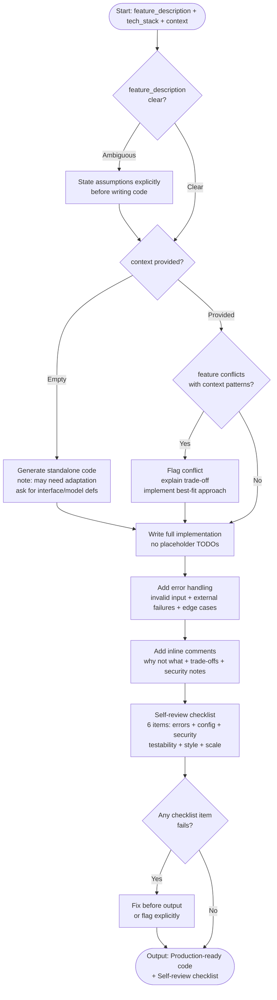

# Skill: Code Generation

## Purpose
Generate complete, production-ready code for a specified feature, including error handling, documentation, and a self-review checklist.

## Input
| Variable | Type | Req | Description |
|----------|------|-----|-------------|
| `tech_stack` | string | Yes | e.g., "TypeScript + Express + PostgreSQL" |
| `feature_description` | string | Yes | Clear summary of target feature (1–5 sentences) |
| `context` | string | Yes | Existing code, interfaces, or architectural constraints |

## Instructions
- **Implementation**: Produce full, runnable code without placeholders.
- **Error Handling**: Implement idiomatic patterns for input validation, service failures, and domain edge cases.
- **Documentation**: Add inline comments for "why" logic, performance trade-offs, and security choices.
- **Verification**: Provide a 6-point checklist (Error paths, Config/Env, Security, Isolation, Style, Scale).
- **Ambiguity**: State all assumptions explicitly before generating code if requirements are unclear.

## Edge Cases
| Case | Strategy |
|------|----------|
| Ambiguous spec | List assumptions; implement the most common interpretation. |
| Missing context | Generate standalone code; note need for local adaptation. |
| Requirement conflict | Priority: Existing codebase patterns > Request specifics; flag conflict. |

## Refactoring Workflow

## Examples
- [Input Example](@examples/input.md)
- [Output Example](@examples/output.md)

## Quality Gate
1. Is the solution the simplest possible?
2. Are failure modes handled?
3. Does it scale 10x in load/size?
4. Are security implications addressed?
5. Is the output testable and observable?

## MCP Dependencies
- `@upstash/context7-mcp`: Library documentation and examples.

## Changelog
| Version | Date | Description |
|---------|------|-------------|
| 1.1.0 | 2026-03-20 | Restructured: moved examples to examples/, references to references/, added compatibility and license fields |
| 1.0.0 | 2026-03-20 | Initial release |
