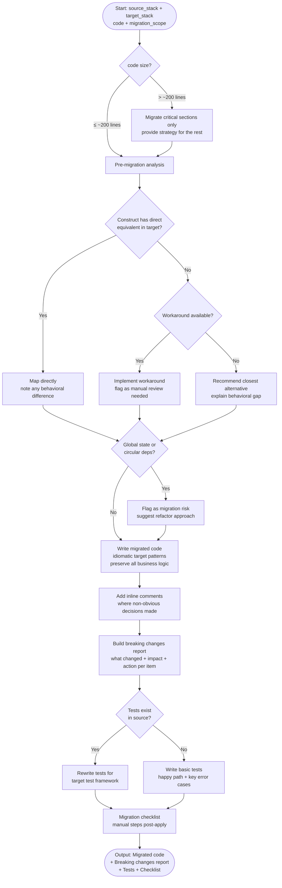

# Skill: Code Migration

## Purpose
Migrate code between tech stacks, producing idiomatic implementation, a compatibility report (breaking changes), and migrated tests.

## Input
| Variable | Type | Req | Description |
|----------|------|-----|-------------|
| `source_stack` | string | Yes | e.g., "Python 2.7 + Flask" |
| `target_stack` | string | Yes | e.g., "Python 3.11 + FastAPI" |
| `code` | string | Yes | Logic to migrate (function/module/class) |
| `migration_scope` | string | Yes | Full module, specific function, tests, or config |

## Instructions
- **Analysis**: Identify constructs with direct equivalents vs. those requiring significant rewrites or workarounds.
- **Implementation**: Produce idiomatic (not literal) code. Preserve business logic and apply target-stack error handling.
- **Compatibility**: List breaking changes, impact on consumers, and required follow-up actions.
- **Testing**: Adapt existing tests or create new ones for the target framework (Happy path + Error cases).
- **Checklist**: Provide a numbered list of post-migration manual steps (Env vars, DB migrations, CI updates).

## Edge Cases
| Case | Strategy |
|------|----------|
| No direct equivalent | Recommend closest alternative; flag for manual review. |
| Large codebase (>200 lines) | Migrate critical sections; provide strategy for the remainder. |
| Global state/Circular deps | Flag as high risk; suggest refactoring approach. |

## Migration Logic

## Examples
- [Input Example](@examples/input.md)
- [Output Example](@examples/output.md)

## Quality Gate
1. Is the solution the simplest possible?
2. Are failure modes handled?
3. Does it scale 10x in load/size?
4. Are security implications addressed?
5. Is the output testable and observable?

## MCP Dependencies
- `@upstash/context7-mcp`: Library documentation and examples.

## Changelog
| Version | Date | Description |
|---------|------|-------------|
| 1.1.0 | 2026-03-20 | Restructured: moved examples to examples/, references to references/, added compatibility and license fields |
| 1.0.0 | 2026-03-20 | Initial release |
