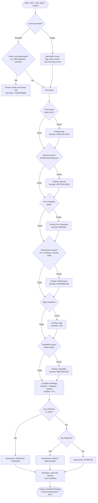

# Skill: Code Review

## Purpose
Perform a structured senior-level code review resulting in prioritized findings with fixes.

## Input
| Variable | Type | Req | Description |
|----------|------|-----|-------------|
| `tech_stack` | string | Yes | e.g., "Java + Spring Boot" |
| `code` | string | Yes | Function, class, module, or PR diff |
| `context` | string | Yes | Purpose, intent, or PR description |

## Instructions
- **Findings**: Categorize by severity (CRITICAL to SUGGESTION) and type (Bug, Security, Performance, Style, Maintainability, Test Coverage).
- **Structure**: Each finding must include **Severity**, **Category**, **Location**, **Problem**, and **Fix** (code snippet).
- **Dimensions**: Evaluate Correctness, Security (SQLi/XSS/Auth), Error Handling, Performance (N+1/Blocking), Style, and Testability.
- **Summary**: Provide total counts by severity, an overall assessment (APPROVE/REQUEST CHANGES/NEEDS DISCUSSION), and Top 3 priorities.

## Severity Reference
| Level | Impact |
|-------|--------|
| CRITICAL | Data loss, security breach, or outage. |
| HIGH | Incorrect behavior or major performance degradation. |
| MEDIUM | Code smell or edge-case logic failure. |
| LOW | Style inconsistency or naming issues. |
| SUGGESTION | Optional quality enhancement. |

## Review Flow

## Examples
- [Input Example](@examples/input.md)
- [Output Example](@examples/output.md)

## Quality Gate
1. Is the assessment objective?
2. Are failure modes identified?
3. Are fixes concrete and actionable?
4. Are security implications addressed?
5. Is the review scoped to the stack?

## MCP Dependencies
- `@upstash/context7-mcp`: Library documentation and examples.
- `@modelcontextprotocol/server-sequential-thinking`: Complex reasoning.

## Changelog
| Version | Date | Description |
|---------|------|-------------|
| 1.1.0 | 2026-03-20 | Restructured: moved examples to examples/, references to references/, added compatibility and license fields |
| 1.0.0 | 2026-03-20 | Initial release |
