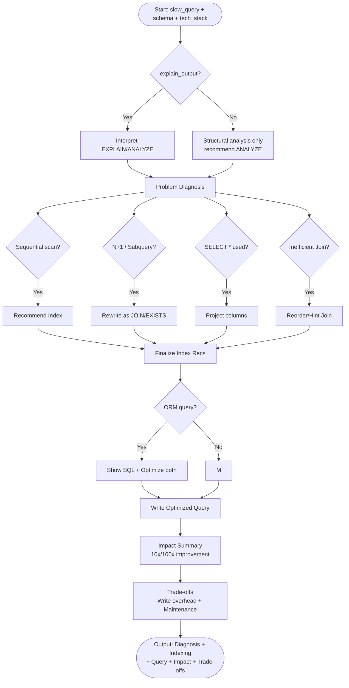

# Skill: Database Query Optimization

## Purpose
Analyze slow queries using EXPLAIN data, recommend optimized indexing strategies, and produce efficient query rewrites.

## Input
| Variable | Type | Req | Description |
|----------|------|-----|-------------|
| `tech_stack` | string | Yes | DB + ORM (e.g., "PostgreSQL + Prisma") |
| `slow_query` | string | Yes | SQL, ORM code, or aggregation pipeline |
| `schema` | string | Yes | Table/Collection schema + current indexes |
| `explain_output` | string | No | Output from EXPLAIN / EXPLAIN ANALYZE |

## Instructions
- **Diagnosis**: Identify root causes (Sequential scans, missing indexes, N+1 patterns, inefficient joins, `SELECT *`).
- **Indexing**: Provide exact `CREATE INDEX` statements. Justify index types (B-tree, GIN, etc.) and estimate row scan reduction.
- **Optimization**: Rewrite the query for maximum efficiency; explain each structural change.
- **Impact**: Summarize "Before vs After" (rows scanned, plan type, latency magnitude).
- **Trade-offs**: Note write overhead, behavioral changes, and maintenance (Vacuum/Stats).

## Edge Cases
| Case | Strategy |
|------|----------|
| No EXPLAIN output | Structural analysis only; recommend running EXPLAIN ANALYZE. |
| ORM-generated query | Show generated SQL; optimize at both ORM and SQL levels. |
| NoSQL (MongoDB) | Adapt to aggregation pipelines and document-specific indexing. |

## Optimization Flow

## Examples
- [Input Example](@examples/input.md)
- [Output Example](@examples/output.md)

## Quality Gate
1. Is the diagnosis based on evidence?
2. Are index statements syntactically correct?
3. Is write overhead addressed?
4. Are ORM vs SQL differences handled?
5. Is the output production-ready?

## MCP Dependencies
- `@upstash/context7-mcp`: Library documentation and examples.
- `@modelcontextprotocol/server-sequential-thinking`: Complex reasoning.

## Changelog
| Version | Date | Description |
|---------|------|-------------|
| 1.1.0 | 2026-03-20 | Restructured: moved examples to examples/, references to references/, added compatibility and license fields |
| 1.0.0 | 2026-03-20 | Initial release |
