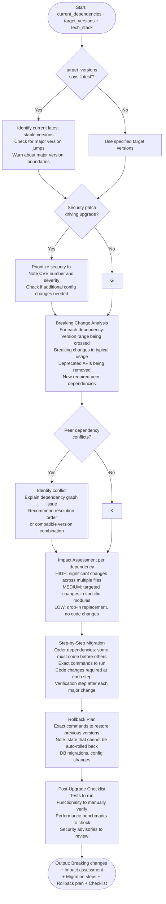

# Skill: Dependency Upgrade

## Purpose
Plan and execute dependency upgrades with breaking change analysis, migration steps, and rollback strategies.

## Input
| Variable | Type | Req | Description |
|----------|------|-----|-------------|
| `tech_stack` | string | Yes | e.g., "Node.js + npm" |
| `current_dependencies` | string | Yes | `package.json` excerpt or list |
| `target_versions` | string | Yes | e.g., "react: 18.3.0" or "latest" |

## Instructions
- **Analysis**: Map version jumps (e.g., 16.x → 18.x). Identify breaking changes, deprecated APIs, and new peer dependencies.
- **Assessment**: Rate impact (HIGH/MEDIUM/LOW) based on code change requirements.
- **Migration**: Provide ordered, numbered steps with exact commands and required code adjustments. Include verification checks.
- **Rollback**: List commands to restore state. Identify non-reversible changes (DB schemas, config).
- **Verification**: Provide a post-upgrade checklist (Tests, manual checks, benchmarks, security advisories).

## Edge Cases
| Case | Strategy |
|------|----------|
| "Latest" requested | Identify latest stable; warn about major version jumps. |
| Peer conflicts | Resolve graph issues; recommend specific order or compatible set. |
| Security patch (CVE) | Prioritize fix; note CVE ID and additional config requirements. |

## Upgrade Flow

## Examples
- [Input Example](@examples/input.md)
- [Output Example](@examples/output.md)

## Quality Gate
1. Is the solution the simplest possible?
2. Are failure modes (rollback) handled?
3. Does it scale to the dependency graph?
4. Are security implications (CVEs) addressed?
5. Is the outcome verified via tests?

## MCP Dependencies
- `@upstash/context7-mcp`: Library documentation and examples.

## Changelog
| Version | Date | Description |
|---------|------|-------------|
| 1.1.0 | 2026-03-20 | Restructured: moved examples to examples/, references to references/, added compatibility and license fields |
| 1.0.0 | 2026-03-20 | Initial release |
