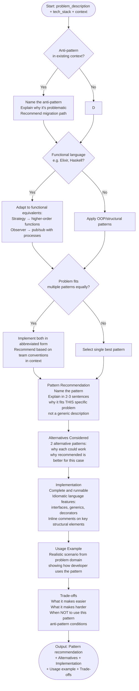

# Skill: Design Pattern Application

## Purpose
Identify, justify, and implement the optimal design pattern for a specific architectural challenge.

## Input
| Variable | Type | Req | Description |
|----------|------|-----|-------------|
| `tech_stack` | string | Yes | e.g., "Java + Spring Boot" |
| `problem_description` | string | Yes | Core design issue and maintenance pain points |
| `context` | string | Yes | Existing structure, constraints, or related modules |

## Instructions
- **Recommendation**: Propose a specific pattern. Explain why it fits the problem in 2–3 sentences.
- **Alternatives**: List 2 alternatives; explain why the recommended one is superior for this case.
- **Implementation**: Provide complete, runnable code using idiomatic features (interfaces, generics, etc.).
- **Usage**: Show a realistic scenario demonstrating the pattern in the target domain.
- **Trade-offs**: Detail what becomes easier, harder, and anti-pattern conditions (when NOT to use).

## Edge Cases
| Case | Strategy |
|------|----------|
| Multiple valid patterns | Implement both in brief; recommend based on existing codebase conventions. |
| Existing anti-pattern | Identify it, explain why it's harmful, and provide a migration path. |
| Functional stack | Adapt OOP patterns to functional equivalents (e.g., Strategy → HOF). |

## Design Logic

## Examples
- [Input Example](@examples/input.md)
- [Output Example](@examples/output.md)

## Quality Gate
1. Is the solution the simplest possible?
2. Are trade-offs clearly stated?
3. Does it scale to the problem size?
4. Are idiomatic language features used?
5. Is the output testable?

## MCP Dependencies
- `@upstash/context7-mcp`: Library documentation and examples.

## Changelog
| Version | Date | Description |
|---------|------|-------------|
| 1.1.0 | 2026-03-20 | Restructured: moved examples to examples/, references to references/, added compatibility and license fields |
| 1.0.0 | 2026-03-20 | Initial release |
