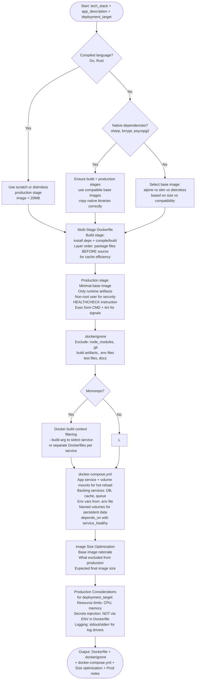

# Skill: Dockerfile Containerization

## Purpose
Generate optimized, production-ready container setups (Dockerfile + Compose) with health checks, signal handling, and multi-stage builds.

## Input
| Variable | Type | Req | Description |
|----------|------|-----|-------------|
| `tech_stack` | string | Yes | e.g., "Node.js + TypeScript" |
| `app_description` | string | Yes | Purpose, entry point, port, runtime needs |
| `deployment_target` | string | Yes | e.g., "AWS ECS", "Kubernetes", "Local" |

## Instructions
- **Dockerfile**: Use multi-stage builds. Optimize layer ordering (Copy deps BEFORE code). Include `HEALTHCHECK`, non-root users, and proper signal handling (`exec` form).
- **Compose**: Create a local development setup with volume mounts (hot reload), backing services (DB, cache), and environment injection. Use `service_healthy` dependencies.
- **Optimization**: Select minimal base images (Alpine/Slim/Distroless). Document size choices and excluded artifacts.
- **Production**: Provide target-specific notes on resource limits, secrets injection (no ENVs in Dockerfile), and logging (stdout/stderr).

## Edge Cases
| Case | Strategy |
|------|----------|
| Compiled (Go/Rust) | Use `scratch` or `distroless` production stages for <20MB images. |
| Native Dependencies | Ensure build and production base images are compatible; copy binaries correctly. |
| Monorepo | Use build context filtering or separate Dockerfiles per service. |

## Container Logic

## Examples
- [Input Example](@examples/input.md)
- [Output Example](@examples/output.md)

## Quality Gate
1. Is the Dockerfile multi-stage?
2. Are layers optimized for caching?
3. Is a non-root user used?
4. Is the production image minimal?
5. is the Compose file runnable?

## MCP Dependencies
- `@upstash/context7-mcp`: Library documentation and examples.

## Changelog
| Version | Date | Description |
|----------|------|-------------|
| 1.1.0 | 2026-03-20 | Restructured: moved examples to examples/, references to references/, added compatibility and license fields |
| 1.0.0 | 2026-03-20 | Initial release |
