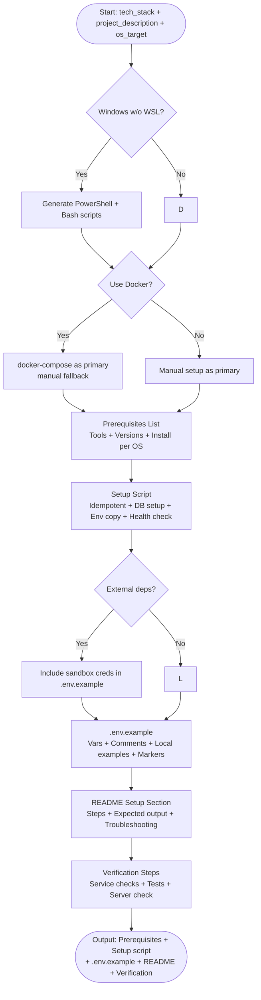

# Skill: Environment Setup

## Purpose
Generate zero-friction onboarding materials including setup scripts, documented `.env.example`, and verification steps to get projects running in <10 minutes.

## Input
| Variable | Type | Req | Description |
|----------|------|-----|-------------|
| `tech_stack` | string | Yes | e.g., "Node.js + PostgreSQL + Redis" |
| `project_description` | string | Yes | project purpose and main components |
| `os_target` | string | Yes | e.g., "macOS + Linux", "all platforms" |

## Instructions
- **Prerequisites**: List required tools with versions and install commands (per OS).
- **Setup Script**: Generate an idempotent shell script (or equivalent) that installs dependencies, runs DB migrations, copies `.env.example`, and performs a basic health check.
- **`.env.example`**: Document every variable with inline comments, safe local examples, and "CHANGE_ME" markers.
- **README**: Provide numbered "Getting Started" steps with expected outputs and common error fixes.
- **Verification**: Include a checklist for DB/cache connectivity, test suite runs, and server responsiveness.

## Edge Cases
| Case | Strategy |
|------|----------|
| Windows (no WSL) | Generate PowerShell scripts; note path/newline gotchas. |
| Docker-based | Provide `docker-compose up` as primary; manual as fallback. |
| 3rd-Party services | Include sandbox credentials/links in `.env.example`. |

## Setup Workflow

## Examples
- [Input Example](@examples/input.md)
- [Output Example](@examples/output.md)

## Quality Gate
1. Is the setup script idempotent?
2. Are all required variables documented?
3. Are OS-specific install commands included?
4. Is there a clear verification path?
5. is the README section concise?

## MCP Dependencies
- `@upstash/context7-mcp`: Library documentation and examples.

## Changelog
| Version | Date | Description |
|---------|------|-------------|
| 1.1.0 | 2026-03-20 | Restructured: moved examples to examples/, references to references/, added compatibility and license fields |
| 1.0.0 | 2026-03-20 | Initial release |
