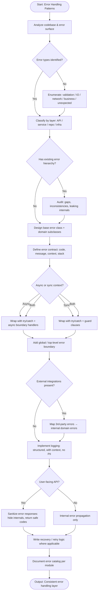

# Skill: Error Handling Patterns

## Purpose
Implement a comprehensive, resilient error handling strategy including typed errors, structured logging, and safe user-facing messaging.

## Input
| Variable | Type | Req | Description |
|----------|------|-----|-------------|
| `tech_stack` | string | Yes | e.g., "TypeScript + Express" |
| `module_code` | string | Yes | Service/Module code needing patterns |
| `error_scenarios` | string | Yes | e.g., "DB failure", "Auth timeout" |

## Instructions
- **Error Types**: Define a typed hierarchy (Base class with code/status/isOperational). Use idiomatic stack patterns (Result types, custom exceptions).
- **Implementation**: Catch errors at the correct layer. Distinguish operational vs. programmer errors. Propagate with context (wrapping).
- **Logging**: Implement structured levels: ERROR (outage), WARN (retry success), INFO (transitions), DEBUG (trace). Include Correlation IDs.
- **Messaging**: Map errors to helpful, non-revealing user-facing messages.
- **Centralization**: Create a global handler (middleware) for consistent response formatting and final logging.

## Edge Cases
| Case | Strategy |
|------|----------|
| Async errors | Ensure boundaries catch promise rejections; avoid silent swallows. |
| 3rd-Party errors | Wrap external exceptions in domain-specific types to prevent leakage. |
| Transient failures | Implement exponential backoff retry logic (Rate limits, timeouts). |

## Error Flow

## Examples
- [Input Example](@examples/input.md)
- [Output Example](@examples/output.md)

## Quality Gate
1. Is the error hierarchy typed?
2. Are operational vs programmer errors separate?
3. Is internal context redacted for users?
4. Are logs structured and contextual?
5. is the central handler used?

## MCP Dependencies
- `@upstash/context7-mcp`: Library documentation and examples.

## Changelog
| Version | Date | Description |
|---------|------|-------------|
| 1.1.0 | 2026-03-20 | Restructured: moved examples/references, added compatibility/license |
| 1.0.0 | 2026-03-20 | Initial release |
